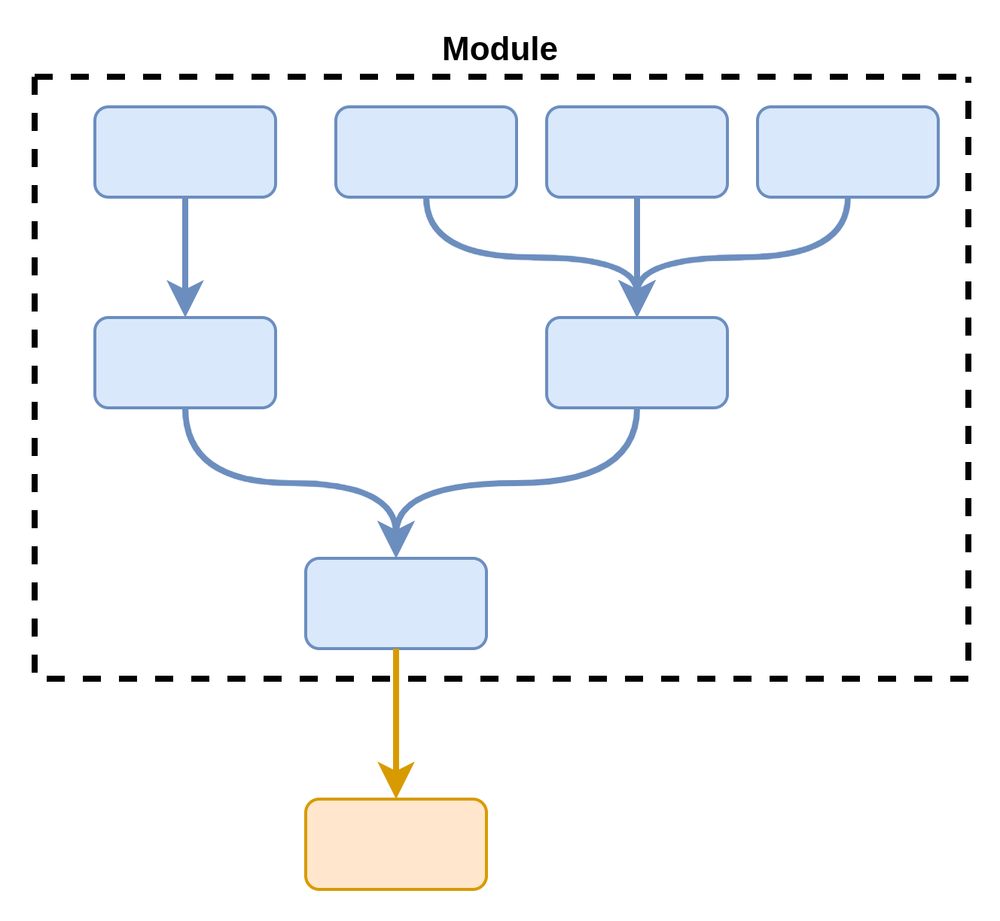
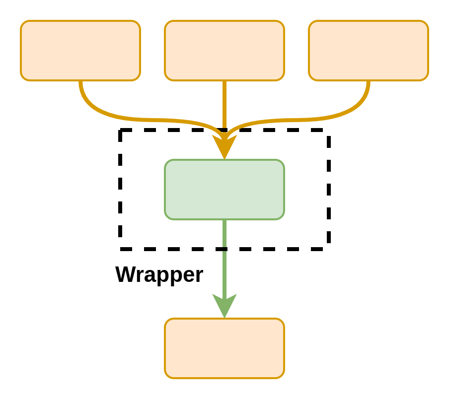

# The easy energy system workflows and wrappers repository

This aims to be a collection of helper workflows and wrappers that aid in quickly developing Energy System (ESM) models, inspired by Snakemake's [workflow catalog](https://snakemake.github.io/snakemake-workflow-catalog/) and [wrapper repository](https://snakemake-wrappers.readthedocs.io/en/stable/).
Its main purpose is enabling researchers to share data workflows between studies to avoid the [bloat](docs/goals.md#bloat-and-reproducibility) problem in large energy system workflows.

Please also consult the following:

- [Our goals](docs/goals.md)
- [Conventions and recommendations](docs/conventions.md)

## Setup

If you wish to test the whole repository, please run.

```shell
mamba env create -f environment.yaml
mamba activate ec_modules
```

>[!note]
> The `ec_modules` environment is mostly used for unit testing! See below for development cases.

If you wish to develop / test an individual module or wrapper, please install its specific environment:

```shell
mamba env create -f wrappers/name_here/environment.yaml
mamba activate name_here
```

## Two options for better reproducibility

There are two different functionalities that `snakemake` provides to speed up workflow creation.

### [Modules](https://snakemake.readthedocs.io/en/stable/snakefiles/modularization.html#modules)

Think of them as **workflows that can be exported to other projects**.
Their settings can be **re-configured**, allowing you to reproduce data with different parametric assumptions.
They have one disadvantage: their **inputs are static**, meaning that you cannot pass results from other snakemake rules.
Modules are best for stable workflows whose inputs are not expected to change.
Some use cases:

- Downloading and converting transmission line data into nodes / regions.
- Downloading and combining datasets of existing power production facilities.



A module can be called as follows:

```python
module hydropower:
    # Plain paths, URLs and github / gitlab calls are possible
    snakefile:
        github(
          "calliope-project/ec_modules", path="modules/hydropower/Snakefile", tag="v1.0.0"
        )
    # Override the module's default configuration
    config: config["hydropower"]

# Rewrites rule names to avoid conflicts (e.g., all -> module_hydro_all)
use rule * from module_hydro as module_hydro_*
```

### [Wrappers](https://snakemake.readthedocs.io/en/stable/snakefiles/modularization.html#wrappers)

These are **reusable `snakemake` rules to interface with applications**.
They are useful for tools with broad use cases but generally stable interfacing. Any kind of software can be called by them as long as it can be executed from a python script (CLI, python libraries, R libraries, etc).



Here is an example for [`tsam`](https://github.com/FZJ-IEK3-VSA/tsam), a tool for time series aggregation:

```python
rule tsam:
    input:
        "timeseries/pv.csv",
        "timeseries/wind.csv",
        "timeseries/demand.csv",
    output:
        "aggregated/typical_periods.csv"
    params:
        noTypicalPeriods = 8,
        hoursPerPeriod = 24,
        segmentation = True,
        noSegments = 8,
        representationMethod = "distributionAndMinMaxRepresentation",
        distributionPeriodWise = False
        clusterMethod = 'hierarchical'
    threads: 8
    wrapper:
        github("calliope-project/ec_modules", path="wrappers/tsam", tag="v0.2")
```
