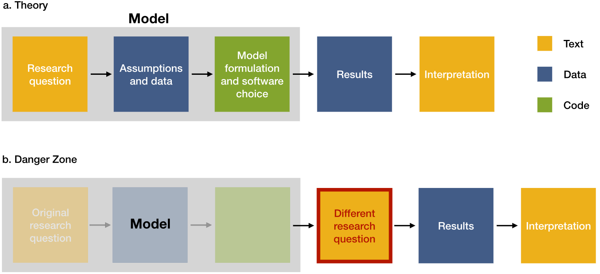
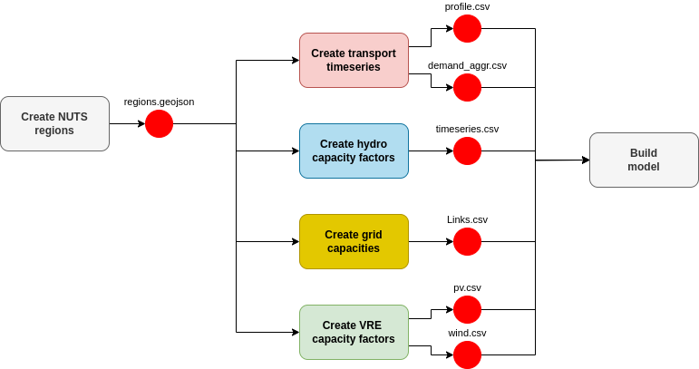

# The Calliope workflow and wrappers repository

This is a collection of helper workflows and wrappers for Calliope models, inspired by Snakemake's [workflow catalog](https://snakemake.github.io/snakemake-workflow-catalog/) and [wrapper repository](https://snakemake-wrappers.readthedocs.io/en/stable/).
It aims to help solve the problem of "bloat" in large energy system workflows.

## What is bloat?

Energy models are very complex combinations of data, code, and modeller assumptions.
As researchers develop them over time, they tend to grow in size and complexity, up to the point where understanding them can be quite a struggle.
Essentially, they turn into [black boxes](https://doi.org/10.1088/2516-1083/ad371e), increasing the risk of combining incompatible assumptions or using depreciated data, which in turn can lead to misleading studies.

<!--  -->

Ever-growing complexity is the main culprit here: as more and more studies are carried out with a model, the number of processing steps needed to create the model grows, leading to bloat.
As an example, [Sector-Coupled Euro Calliope](https://github.com/calliope-project/sector-coupled-euro-calliope) (a high-resolution model of Europe) has over 100 processing steps!
Researchers _need_ previous work in order to advance the field and produce better insights, but the decreasing understandability eventually gets in the way.

Energy research is hardly the only field were this is a problem, however: bio-informatics and atmospheric modelling face similar problems.
Contrary to them, however, energy research has not been very good at finding solutions.
**Modularisation is needed to abstract complexity, letting people focus on doing science instead!**

<p align="center"></p>

## Setup

Please run the following commands:

```shell
mamba env create -f environment.yaml
mamba activate ec_modules
```

## Goals

Successful modularisation must meet the following criteria to ensure maximum compatibility and keep conflicts at a minimum.

- **Inputs must be file/folder paths**: to keep modules agnostic to project structure.
- **Outputs should only be files**: meaning that code variables cannot be passed between modules.
- **Outputs must be specified by templates**: modules might need to use the output of other modules as input (e.g., a _pv_capacity_ module might use a `*.geojson` file produced by a _regions_ module). To avoid breaking functionality, output template files must be specified in the `templates/` folder of a module to let other developers know what they'll be working with.
- **File structure should be standardised**: to help users reach relevant files quickly, modules must at least have _src_, _out_, _templates_ and _tmp_ folders.
- **Containerised**: each module must use its own _env_ to keep version conflicts at a minimum.
- **Isolated configuration YAML**: some sort of module configurability is needed to keep things flexible. However, modules must only have access to their own configuration parameters to avoid potential conflicts. Providing template configuration files is also recommended.
- **Debuggable and testable**: problems are bound to happen, so modules should be relatively easy to debug, and should include a few test cases by default.


## Proposals

These are tryouts since Snakemake is very picky on how code is included.

Todo:

- [x] Find a pseudo-modularisation method within a single repo (most friendly to current calliope approaches).
- [ ] Find an approach using Snakemake's wrapper functionality.
- [ ] If not all requirements are fulfilled, look for alternative approaches.

### Candidate modules

This is a list of potential candidates for modularisation. **Bold** implies the module is likely a pre-requisite for others.

Euro-Calliope modules (detailed summary can be found [here](docs/euro-calliope%20DAG%20structure%202024-04-02.pdf)):

- [ ] Bioenergy
- [ ] **Potentials** (?)
- [ ] Electrical load
- [ ] Nuclear generation
- [ ] **Spatial units**
- [ ] Transmission
- [ ] Wind/solar
- [ ] Hydro

Sector Coupled Euro-Calliope modules:

- [ ] Transport
- [ ] Heat
- [ ] Industry
