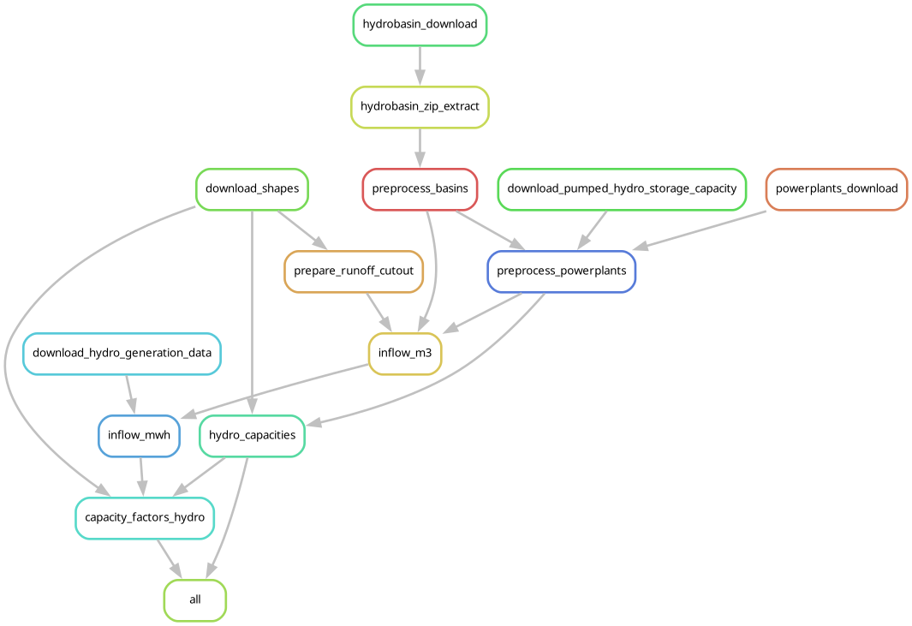

# Module requirements

## File structure

We attempt to follow `snakemake`'s [recommended structure](https://snakemake.readthedocs.io/en/stable/snakefiles/deployment.html#distribution-and-reproducibility) to ensure our modules can be easily exported to other projects.
Additionally, we extend it with a few quality of life improvements.

??? example "Example of a fully featured module"
    Most modules should follow a structure similar to the one below:
    ```tree
    modules/example/
    ├── AUTHORS
    ├── LICENSE
    ├── README.md
    ├── rulegraph.png
    ├── config/
    │   └── default.yaml
    ├── docs/
    │   └── extra_docs.md
    ├── resources/
    │   ├── automatic/
    │   │   ├── download1.nc
    │   │   └── download2.csv
    │   └── user/
    │       └── user_shapes.geojson
    ├── results/
    │   ├── plots/
    │   │   └── graph.png
    │   ├── table_data.csv
    │   └── spatial_data.nc
    └── workflow/
        ├── Snakefile
        ├── envs/
        │   ├── geo.yaml
        │   └── shell.yaml
        ├── internal/
        │   ├── internal_config.yaml
        │   └── mapping.csv
        ├── profiles/
        │   └── default/
        │       └── config.yaml
        ├── report/
        │   └── review.rst
        ├── rules/
        │   ├── rules1.smk
        │   └── rules2.smk
        ├── schemas/
        │   └── default.schema.yaml
        └── scripts/
            ├── rule_script.r
            └── rule_script.py
    ```

### Obligatory components

Please ensure that your module has the following:

- An `AUTHORS` file. This lists all the people who have contributed to the module.
- A `LICENSE` file. This should refer to the `AUTHORS` file above. To ensure license compatibility, we only permit permissive licenses like [MIT](https://opensource.org/license/mit).
- A `README.md` file. Here you describe the module's functionality using our standard template (see [documentation](#documentation)).
- A `config/default.yaml` file. This contains the module's default configuration.
It serves only as an example: users will override it using `snakemake`'s [`module` functionality](https://snakemake.readthedocs.io/en/stable/snakefiles/modularization.html#modules).
- A `resources/` folder.  All **automatically downloaded data** and **user inputted data** used by your workflow should be deposited in `automatic/` and `user/`, respectively.

    ??? tip "The importance of `resources/user/` and `resources/automatic`"
        This convention allows us to avoid ambiguity in where  user modifiable files will be.

        ```tree
        resources/
        ├── automatic/
        │   ├── download1.nc
        │   └── download2.csv
        └── user/
            └── user_shapes.geojson
        ```

- A `results/` folder. All **rule outputs** of your workflow should be deposited here.

    ??? info "Why separate folders for `resources/` and `results`/?"
        The separation between `resources/` and `results/` is mostly to enable easier bookkeeping and to help module users differentiate between the data your module _needs_ and data you have _processed_.

- A `workflow/` folder with the following:
    - A `Snakefile`. This contains the module's main `snakemake` functionality (see [ensuring modularity](#ensuring-modularity)).
    - An `envs/` folder. All your `conda` environments live here.
    - An `internal/` folder. Small files needed by your workflow should be placed here.
    These can be `.yaml` files with internal configuration or `.csv` files with mappings to aid in parsing.
    - A `profiles/default/config.yaml` file. Our standard `snakemake` [profile](https://snakemake.readthedocs.io/en/v8.18.0/executing/cli.html#profiles) configuration.

        ??? warning
            `profiles/default/config.yaml` should not be altered!
            This file's settings ensure that wrappers and conda environments execute seamlessly across modules.

    - A `rules/` folder. This contains all the `rule.smk` files used by your module.
    - A `schemas/` folder. Schemas used [validate](https://snakemake.readthedocs.io/en/stable/snakefiles/configuration.html#validation) user configuration should be placed here.
    - A `scripts/` folder. All python / R code used by your rules should be here.

### Optional components

You can additionally compliment your module with the following:

- A `docs/` folder with additional documentation.
- In `workflow/`:
    - A `reports/` folder. Automatic `snakemake` [reports](https://snakemake.readthedocs.io/en/stable/snakefiles/reporting.html) can be placed here. This will allow users to easily follow your workflow, evaluate runtimes and even visualise plots!

## Ensuring modularity

Modules are essentially workflows that can be exported to other projects. They operate largely in the same way, with some key differences.

- [Auxiliary files](https://snakemake.readthedocs.io/en/stable/snakefiles/rules.html#accessing-auxiliary-source-files) needed by the module (e.g., files in `internal/` or `schema/`) must be loaded by using `workflow.source_path()`. This will tell `snakemake` that it needs to look for the file at the module-level.

    ??? example "Example: loading a schema"
        :cross_mark: This will fail (the schema file does not exist on the user-side).

        ```python
        validate(config, "schema/config.schema.yaml")
        ```
        :white_check_mark: And this will work (`snakemake` will deliver the schema to the user)!

        ```python
        validate(config, workflow.source_path("schema/config.schema.yaml"))
        ```

- The default configuration (`config/default.yaml`) will _always_ be overridden by users. This makes documentation quite important, as `default.yaml` is essentially just a suggestion of how to use the module!
- Both module developers and users must use our standard profile in `workflow/profiles/default/config.yaml`. Otherwise, wrappers and `conda` won't work as intended.
- We generally recommend to keep environments (`workflow/envs/`) as small and rule-specific as possible.
This will make your workflow easier to maintain.

## Configuration

We generally allow developers to setup their module's configuration in the most intuitive way to them.
However, we do have some important guidelines:

1. **Internal configuration** is for settings that should be protected to ensure your module works as intended.
This could be databases, mappings, static parametrisation, etc.
    - This type of configuration should be placed here:

        `modules/your_module/workflow/internal/internal_config.yaml`

    - To ensure this is loaded properly, you must follow our [modularity guidelines](#ensuring-modularity) for auxiliary files.

        ??? example "Loading internal configuration"

            ```python
            with open(workflow.source_path("resources/internal_config.yaml"), "r") as f:
            internal = yaml.safe_load(f)
            ```

2. **User configuration** are all settings that can be modified by users.
    - A default example should be placed here:

        `modules/your_module/config/default.yaml`.

    - If the module requires user-provided files, add a `use_default_user_resources` key:
        - If `True`, the module should download "default" files to emulate user inputs and request them via the `all` rule.
        This serves both as an example of how to use the module, and makes testing easier.
        - If `False`, these download rules and the `all` rule are deactivated.
        This avoids name conflicts when someone uses your module.

        ??? example "Example: `use_default_user_resources` in a hydropower module"

            Our example hydropower module expects two files: a file with polygon shapes, and a dataset with powerplant data.
            An example of each is downloaded if requested.

            ```python
            if config["use_default_user_resources"]:
                rule user_input_shapes:
                    message: "Download national resolution shapes of EU27 countries."
                    params:
                        url = internal["resources"]["default_user_shapes"],
                    output: "resources/user/default_shapes.geojson"
                    conda: "../envs/shell.yaml"
                    shell: "curl -sSLo {output} '{params.url}'"

                rule user_input_powerplants:
                    message: "Download hydropower plant statistics for EU27 countries."
                    params:
                        url = internal["resources"]["default_user_powerplants"],
                    output: "resources/user/default_powerplants.csv"
                    conda: "../envs/shell.yaml"
                    shell: "curl -sSLo {output} '{params.url}'"
            ```

            The `all` rule then requests the module to run for these default inputs.
            Notice that the requested output names match those of the default user inputs, meaning relevant `wildcards` will be triggered.

            ```python
            if config["use_default_user_resources"]:
                rule all:
                    message: "Generate default output for 'hydropower'."
                    input:
                        expand(
                            "results/shapes/{resolution}/{year}/capacity_factors_ror.csv",
                            resolution=['default'], year=[2018]
                        ),
                        expand(
                            "results/shapes/{resolution}/{year}/capacity_factors_reservoir.csv",
                            resolution=['default'], year=[2018]
                        )
            ```


            To deactivate the default, all users have to do is set the default to `False` in their configuration, preventing conflicts between the default files and their setup.

            ```yaml
            use_default_user_resources: False

            ```

3. User inputs should be validated.
    - **user configuration** should be validated using the configuration schema.
    - **user input files** should be checked for relevant data within your rules (e.g., comparing country ISO codes to those supported by the module, checking column names, compatible units, etc).

## Documentation

The `README.md` file should be a pragmatic quick example of what your module needs to function.
It should contain at least the following things:

- [X] A mermaid diagram briefly showing its automatically downloaded resources, user inputs, and outputs.
- [X] A DAG showing the rule order.
- [X] A citation text.
- [X] A references section (if your workflow is based on the work of others).

If additional context is needed, please place it in the `docs/` folder.

??? example "Example: Hydropower module"
    # Euro-Calliope hydropower

    A module to produce hourly timeseries of hydropower plants in Europe.

    ## Input-Output

    Here is a brief IO diagram of the module's operation.

    ```mermaid
    ---
    title: hydropower
    ---
    flowchart LR
        D1[("`**Automatic**
            HydroBASINS
            JRC-hydropower
            IRENA energy generation
            ERA5
            Geth et al 2015
        `")] --> |Download| M

        C1[/"`**User**
            shapes.geojson
        `"/] --> M((hydropower))

        M --> O1("Timeseries
            capacity_factors_RoR.csv
            capacity_factors_reservoir.csv
            ")

        M --> O2("Capacity
            hydropower_supply.csv
            hydropower_storage.csv
            ")
    ```

    ## DAG

    Here is a brief example of the module's steps.

    

    ## Citation

    Tröndle, T., & Pickering, B. (2021). Euro-Calliope Hydropower [Computer software]. https://doi.org/10.5281/zenodo.3949793

    ## References

    - Lehner, B. and Grill, G. (2013), Global river hydrography and network routing: baseline data and new approaches to study the world's large river systems. Hydrol. Process., 27: 2171-2186. https://doi.org/10.1002/hyp.9740
    - Geth, F., Brijs, T., Kathan, J., Driesen, J., & Belmans, R. (2015). An overview of large-scale stationary electricity storage plants in Europe: Current status and new developments. Renewable and Sustainable Energy Reviews, 52, 1212-1227.
    - Hofmann, F., Hampp, J., Neumann, F., Brown, T., & Hörsch, J. (2021). atlite: A Lightweight Python Package for Calculating Renewable Power Potentials and Time Series (Version 0.2.5) [Computer software]. https://doi.org/10.21105/joss.03294
