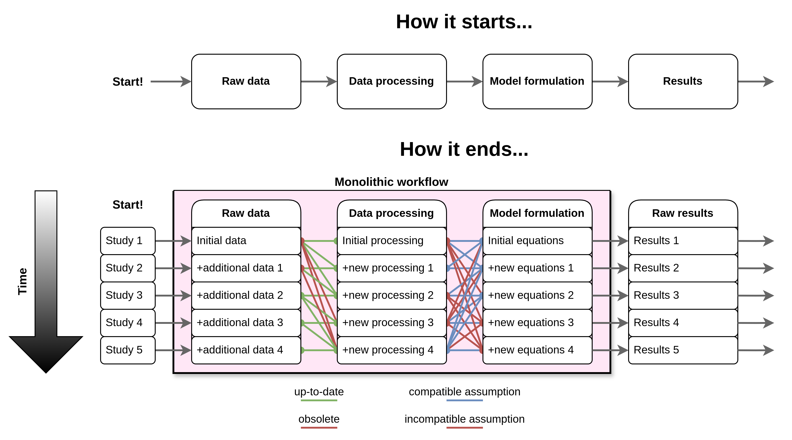

# Our goals

In recent years, energy modelling researchers have made efforts to improve the transparency of how their models are created.
Multiple open-source workflows have appeared, each delineating the many steps and tools employed to build specific models. These workflows usually aim to be compatible with a single modelling framework, and are composed of a series of "steps", usually taking the form of a direct acyclic graph (DAG).

- [Sector-Coupled Euro Calliope](https://github.com/calliope-project/sector-coupled-euro-calliope): a workflow that builds a high-resolution model of Europe for the Calliope framework. Built in Snakemake, currently has 82 steps.
- [PyPSA-Eur](https://github.com/PyPSA/pypsa-eur/tree/master): another european model workflow, built for the PyPSA framework. Also built in Snakemake, currently with 105 steps.
- [message-ix-models](https://docs.messageix.org/projects/models/en/latest/): a data processing toolbox to build MESSAGEix-GLOBIOM models. Number of steps unknown.
- [OSeMOSYS Global](https://github.com/OSeMOSYS/osemosys_global): workflow to build global electricity system models, built for the OSyMOSYS framework. Currently has 26 steps.

Although each model has its own differences, the data needed by them is often similar (demand profiles, existing capacity, land availability limits, etc.).

## Bloat and reproducibility

In theory, more research should lead to scientific refinement.
Scientists _need_ previous work to be accessible in order to advance the field and produce better insights.
The current approach of model-specific workflows hampers progress in two ways.

1. **By making sharing methodological improvements more difficult**, since these processes are "locked-in" to a specific tool (e.g., Calliope, PyPSA, OSeMOSYS, etc). This leads to a lot of re-implementation between communities, which is error prone and more difficult to evaluate, which diminishes trust.
2. **By making model workflows less comprehensible over time**. Workflows tend to grow in size and complexity as more studies are conducted with them, eventually turning into [black boxes](https://doi.org/10.1088/2516-1083/ad371e), increasing the risk of combining incompatible assumptions or using depreciated data, which in turn can lead to misleading studies.

## Looking at other fields for a solution

Energy research is hardly the only field were this is a problem: bioinformatics and atmospheric modelling face similar problems.
These fields share common [data characteristics](https://www.bsiranosian.com/bioinformatics/why-are-bioinformatics-workflows-different/) with energy research:

- Large file sizes.
- The need to process both common and proprietary formats.
- Relatively high computational intensity when processing data.
- Heterogeneous and complicated data processing steps.

The widespread use of Snakemake in energy model workflows hints at current issues being caused by poor collaboration, not by any inherent differences between these fields.
Snakemake was specifically developed to make data processing methods easier between bioinformaticians.
**What the field needs is to enable collaboration, letting people focus on doing science instead of reinventing the wheel!**

## Further reading

- Wratten, L., Wilm, A. & Göke, J. Reproducible, scalable, and shareable analysis pipelines with bioinformatics workflow managers. Nat Methods 18, 1161–1168 (2021). https://doi.org/10.1038/s41592-021-01254-9
