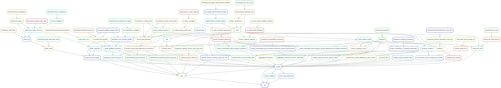
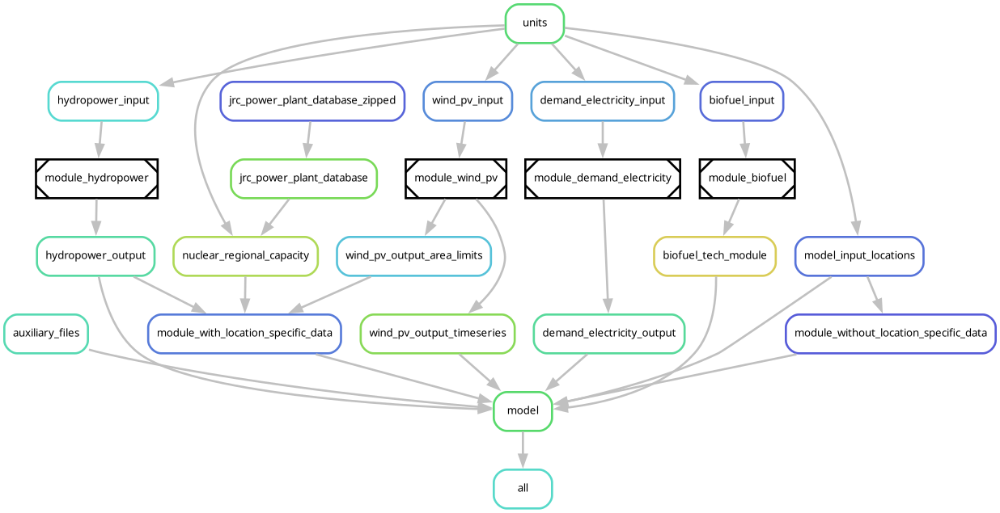

# Home

Welcome to the [`ec_modules`](https://github.com/calliope-project/ec_modules) repository!

Our main purpose is enabling energy researchers and institutions to share, reuse and improve the data workflows used to construct Energy System Models, inspired by `snakemake`'s [workflow catalog](https://snakemake.github.io/snakemake-workflow-catalog/) and [wrapper repository](https://snakemake-wrappers.readthedocs.io/en/stable/).

We aim to do so in the following ways:

- By providing an expanding collection of [high-quality modular workflows](./user_guide/modules.md) used for peer-reviewed research.
- By providing a wide array of [wrappers](./user_guide/wrappers.md) for popular tools used in Energy System research.

In essense, we wish to turn very complex models that are hard to maintain and re-use...

Into a range of digestible, well supported tools that get better and better over time!

## For users

Feel free to check our [user guide](user_guide/getting_started.md)!

## For developers

Please check out our [conventions](development_guide/conventions.md) and [guidelines](./development_guide/getting_started.md).
