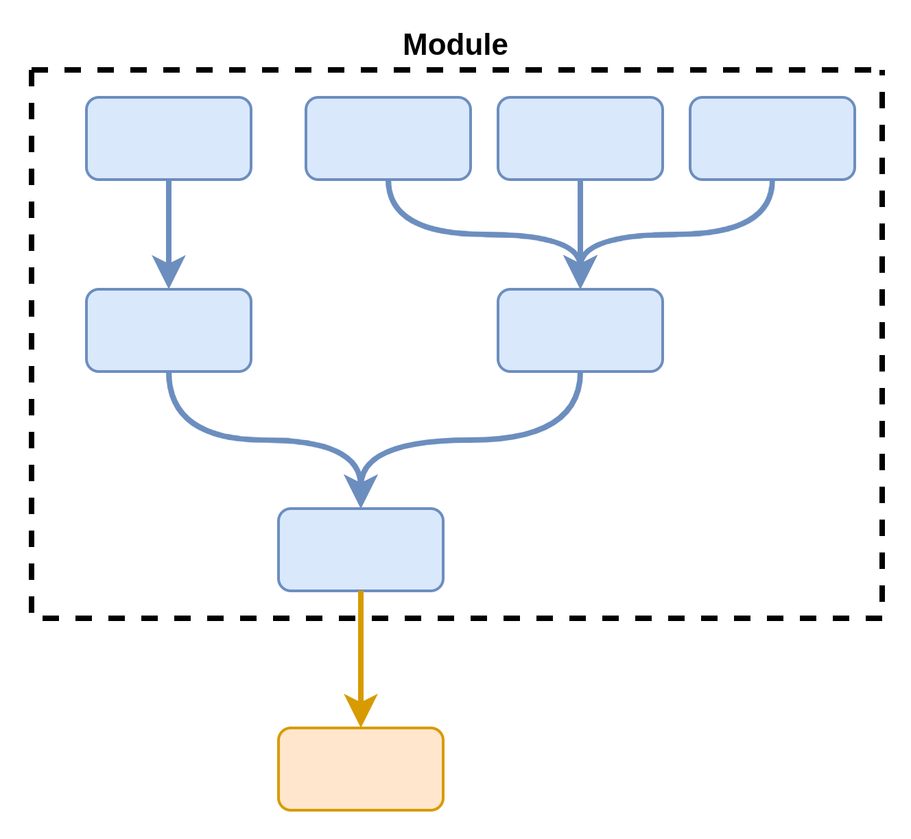
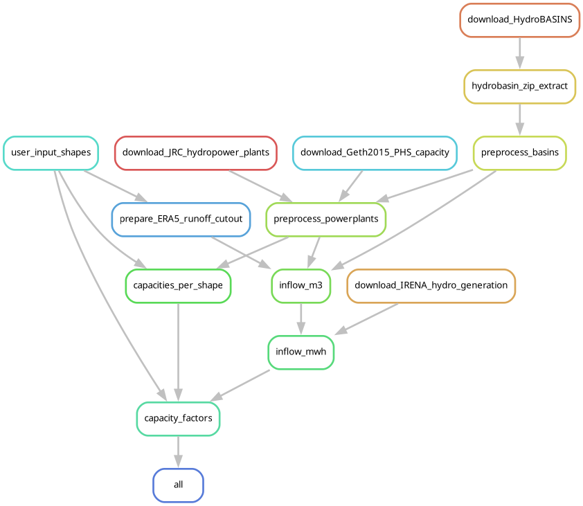

# Using Modules

Think of them as **workflows that can be exported to other projects**.
Their settings can be **re-configured**, allowing you to reprocess data with different parametric assumptions.
Modules are best for stable workflows whose inputs are not expected to change much.
Some use cases:

- Converting transmission line data into nodes / regions.
- Calculating renewable potentials for a given set of regions.
- Combining datasets of existing power production facilities.
- And many more!

You can read more about modules in the [`snakemake` documentation](https://snakemake.readthedocs.io/en/stable/snakefiles/modularization.html#modules).

## Visualising a module

Modules can be visualised as a regular DAG (direct acyclic graph) that "connects" to your workflow.

??? example "Module as DAG"
    

However, it's generally more useful to think of them as an IO (input-output) diagram that you can influence by reconfiguring it.
The databases used and the order of the processing steps may not change, but the output can be influenced depending on the configuration files you give it.

!!! example "Module as IO"

    In this case, the module's results will change depending on the shapes and powerplants that the configuration file (`config.yaml`) points to.

    ??? info "Hydropower workflow"

        

    ```mermaid
    flowchart LR
        id1[("
            ERA5
            HydroBASINS
        ")] --> |Download| M
        C[/"
            config.yaml
            - shapefile.geojson
            - powerplants.csv
        "/] -->M((hydropower))
        M --> O1("
            capacity-factors-RoR.csv
            capacity-factors-basins.csv
            ")
        M --> O2("
            region-power-capacity.csv
            region-storage-capacity.csv
            ")
    ```

## Configuring a module

Modules will generally have instructions on how to configure them in their documentation.
Regardless, you can always find a default configuration in the following location:

```tree
modules/example/
├── README.md
└── config/
    └── default.yaml      # Here!
```

We recommend storing module configuration files separately, and adding them to your general configuration with module-specific keys.
This will ensure there are no conflicts between modules and your general configuration.

??? example "Separate configuration file structure"
    ```tree
    your_workflow/
    ├── README.md
    └── config/
        ├── general.yaml            # Your general configuration!
        └── modules/
            ├── heat.yaml           # Module-specific configuration!
            ├── hydropower.yaml
            └── transport_road.yaml
    ```

For a `hydropower` module, the configuration would look like this:

```yaml
module-hydro:
  # Resources is a general way of communicating that a module
  # expects files from users!
  resources:
    resolution_file: "resources/shapes_spain.geojson"
  first_year: 2016
  final_year: 2016
  hydro_power_database:
    version: "v10"
  HydroBASINS_database:
    level: "07"
```

## Using our modules

Adding a module to your `snakemake` workflow is easy, as long as you have followed our [getting started](getting_started.md) instructions.
All you need to do is import it with the following structure:

```python
# Extend your general configuration with your module-specific configuration
configfile: "config/modules/hydropower.yaml"

module hydropower:
    # Request snakemake to use a specific module version (tag)
    snakefile:
        github(
          "calliope-project/ec_modules",
          path="modules/hydropower/Snakefile",
          tag="v1.0.0"
        )
    # Provide your module-specific configuration
    config: config["hydropower"]
    # Add a prefix to to avoid file conflicts
    # (e.g., results/output.csv -> module-hydropower/results/output.csv)
    prefix: "module-hydropower"

# Rewrite rule names to avoid conflicts (e.g., all -> module_hydro_all)
use rule * from hydropower as module_hydropower_*
```

??? example "using `prefix:`"

    `prefix:` enables you to avoid file name conflicts between modules by prepending all paths in the module with an additional folder.
    This also affects the paths in your configuration!
    In the [configuration example](#configuring-a-module) above, `"resources/shapes_spain.geojson"` will _also_ be affected!

    So, you should place your `shapes_spain.geojson` file in the following location:

    `prefix:` + `resources/shapes_spain.geojson` -> `module-hydropower/resources/shapes_spain.geojson`

??? warning "`snakemake` compatibility"

    Some modules might be incompatible with older versions of `snakemake`.
    We recommend to update `snakemake` to the newest version possible in such cases.
    We generally enforce `snakemake = 8.10` as the minimum supported version.
