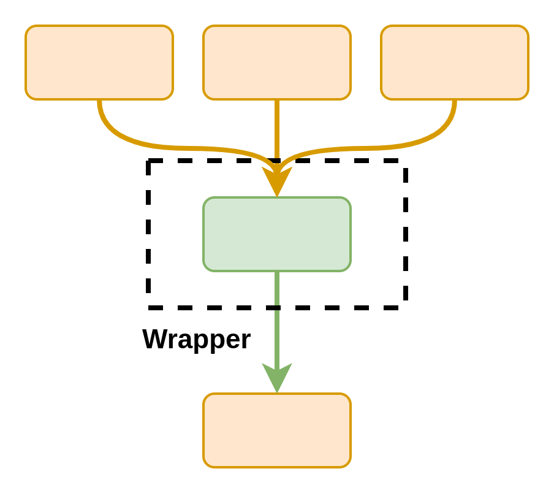

# [Wrappers](https://snakemake.readthedocs.io/en/stable/snakefiles/modularization.html#wrappers)

These are **reusable `snakemake` rules to interface with applications**.
They are useful for tools with broad use cases but generally stable interfacing.
Any kind of software can be called by them as long as it can be executed from a python script (CLI, python libraries, R libraries, etc).

Once you have a good wrapper in place, you do not have to re-write code for that operation again!

## Visualising a wrapper

Wrappers can be seen as a single `snakemake` rule that calls code that is _external_ to your workflow.

??? example "Wrapper as DAG"
    

Similar to modules, it is more practical to see them as IO diagrams.
In this case, a wrapper needs inputs (which can be produced by any rule) which, in combination with some parameters, will give you files.

??? example "Wrapper as IO"

    You can even configure some wrapper outputs to be optional!

    ```mermaid
    flowchart LR
        I1(data1.csv) --> W((timeseries))
        I2(data2.csv) --> W
        I3(data3.csv) --> W
        W --> O1(typtical_periods.csv)
        W --> |Optional| O2(accuracy_indicators.csv)
        W --> |Optional| O3(index_matching.csv)
    ```

## Importing a wrapper

Here is an example for [`tsam`](https://github.com/FZJ-IEK3-VSA/tsam), a tool for time series aggregation.

```python
rule tsam:
    # The wrapper can take any number of .csv files as long as
    # they have a specific structure
    input:
        "timeseries/pv.csv",
        "timeseries/wind.csv",
        "timeseries/demand.csv",
    output:
        periods = "aggregated/typical_periods.csv",
        # Optional output
        plot_accuracy = "aggregated/
    params:
        # Some parametrisation...
        noTypicalPeriods = 8,
        hoursPerPeriod = 24,
        segmentation = True,
        noSegments = 8,
        representationMethod = "distributionAndMinMaxRepresentation",
        distributionPeriodWise = False
        clusterMethod = 'hierarchical'
    wrapper: "v0.0.2/wrappers/tsam/timeseries"
```

## Using our wrappers

All you have to do is add a `wrapper:` directive to your rule in the form of `"{tag}/wrappers/{wrapper location}"`. In the example above: `"v0.0.2/wrappers/tsam/timeseries"` has `v0.0.2` as the tag and `tsam/timeseries` as the wrapper location.

By pinning the wrappers to a specific repository tag, you ensure your workflow remains stable against future changes to the wrapper.
Later, if you wish to use a more updated version of that wrapper, you can update the tag to the latest version.

You can find all our current wrappers here:

- <https://github.com/calliope-project/ec_modules/tree/main/wrappers/>.
