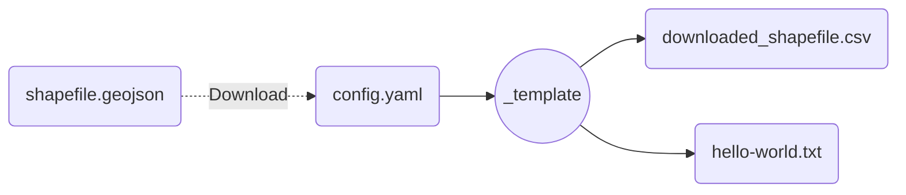
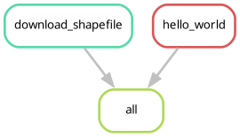

# Module template

<!-- Please follow this file structure when developing modules.
It is based on `snakemake`'s [recommended structure to ensure reproducibility](https://snakemake.readthedocs.io/en/v8.18.0/snakefiles/deployment.html), and will save you a lot of trouble. -->

<!--
_template/
├── config
│   └── default.yaml             # Default configuration. Can be overridden by users.
├── LICENSE
├── results                      # Place all your output files here.
└── workflow
    ├── envs
    │   └── shell.yaml           # All rules should use a conda environment defined here.
    ├── profiles
    │   └── default
    │       └── config.yaml      # Do not delete!
    ├── report                   # Optional, generate automatic reports with snakemake!
    ├── resources
    │   └── internal.yaml        # Small files needed by your module, such as internal configuration.
    ├── rules
    │   └── example.smk          # Place all your workflow rules here.
    ├── schemas
    │   └── config.schema.yaml   # Optional, validate user configurations automatically!
    ├── scripts
    │   └── example.py           # All your scripts should go here.
    └── Snakefile
-->

This module is a simple example of how you can build exportable and reproductible workflows in `snakemake`.

## Input-Output

<!--
Always add a brief description of what your module needs to work.
A simple input-output structure is often enough.
-->

Here is a brief summary of the IO structure of the module.
It just downloads a file with region shapes from a remote repository and also creates a text file with a greeting!

## DAG

Here is a brief overview of the module's steps.
Please consult the code for more details.

