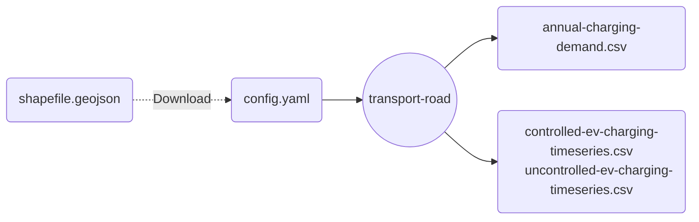
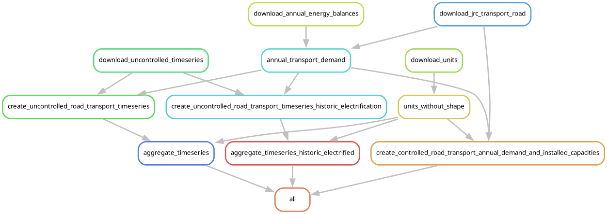

# Module: Transport - Road

A module to create transport demand for European Energy Models.

>[!IMPORTANT]
>For now, only electrified transport is fully supported.
>In the future, this module will instead follow a VKM approach that is more flexible.

## Input-Output

Here is a brief summary of the IO structure of the module.

Users must specify a remote location of shapefile with the desired subregions in the configuration, which will be downloaded and processed into timeseries and capacity values by the module.

## DAG

Here is a brief overview of the module's steps.
Please consult the code for more details.

