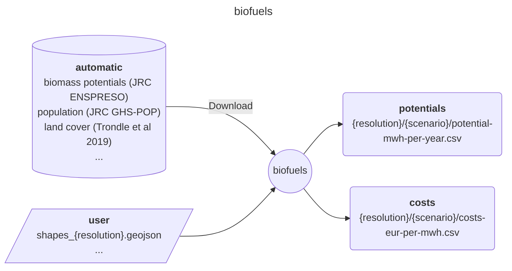

# Easy Energy Modules - biofuels

A module preparing biofuels cost and potentials

## Input-Ouput

Here is a brief IO diagram of the module's operation.

### User

Four `{resolution}` options are possible: national, regional, ehighways, continental.
These are based on supported [Euro-Calliope datasets](https://zenodo.org/records/6600619).

- **resources/user/shapes_{resolution}.geojson**: desired spatial resolution.

### Results

Three ENSPRESSO `{scenario}` cases can be requested: low, medium and high.

- **results/{resolution}/{scenario}/potential-mwh-per-year.csv**: potential per region and bio-product.
- **results/{resolution}/{scenario}/costs-eur-per-mwh.csv**: cost per region and bio-product.
- **results/{resolution}/{scenario}/costs-eur-per-mwh.csv**

## DAG

Here is a brief example of the module's steps.

## Citation

Tröndle, T., & Pickering, B. (2021). Euro-Calliope Biofuel [Computer software]. <https://doi.org/10.5281/zenodo.3949793>

## References

- Ruiz, Pablo (2019): ENSPRESO - BIOMASS. European Commission, Joint Research Centre (JRC) [Dataset] PID: <http://data.europa.eu/89h/74ed5a04-7d74-4807-9eab-b94774309d9f>
