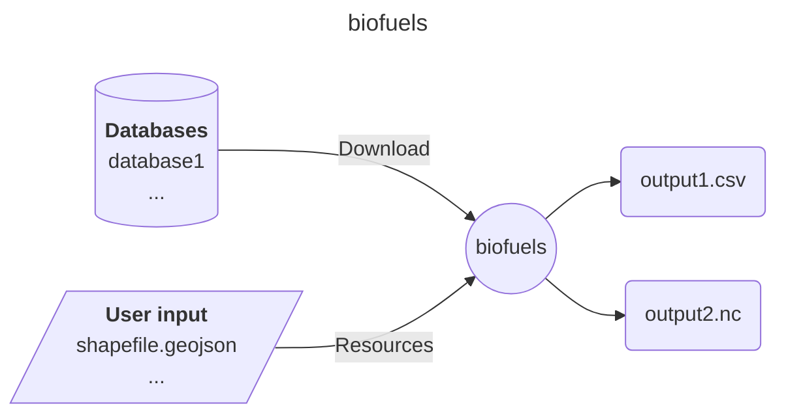

# Easy Energy Modules - biofuels

A module preparing biofuels cost and potentials

## Input-Ouput

Here is a brief IO diagram of the module's operation.

## DAG

Here is a brief example of the module's steps.

