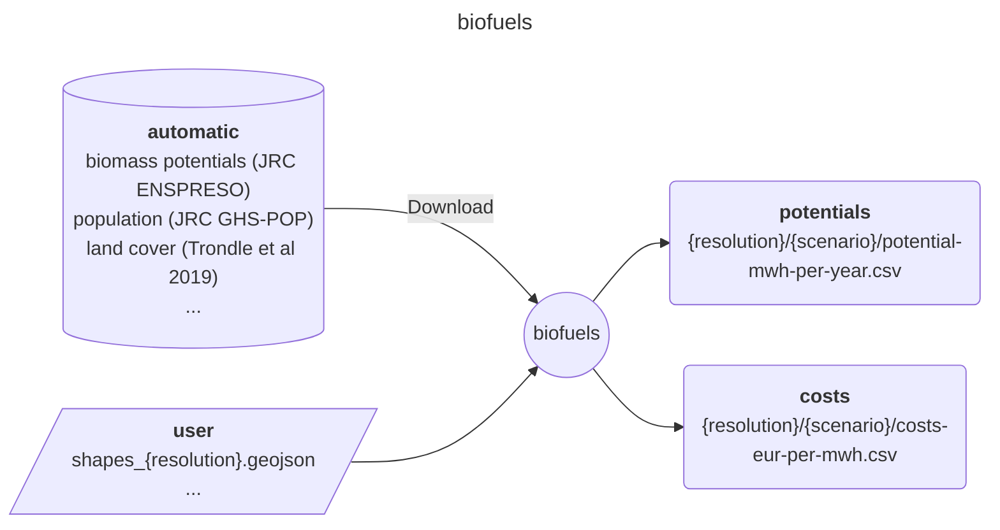

<!-- Please provide a concise summary of the module in this section. -->
<!-- --8<-- [start:intro] -->
# Euro-Calliope - biofuels

A module preparing biofuels cost and potentials for European nations using the [ENSPRESSO - BIOMASS](https://data.jrc.ec.europa.eu/dataset/74ed5a04-7d74-4807-9eab-b94774309d9f) database.

<!-- --8<-- [end:intro] -->

## Input-Ouput

<!-- Please fill in this diagram including: wildcards, user resources and final results. -->
<!-- --8<-- [start:mermaid] -->

<!-- --8<-- [end:mermaid] -->

### Wildcards

<!-- Please explain what wildcards are required by users here. -->
<!-- --8<-- [start:wildcards] -->

- **{resolution}**: Determines the number of regions that the module will process. Importantly, it must be specified for the correct input file, which can be obtained from [Euro-Calliope datasets](https://zenodo.org/records/6600619). The following options are possible:
    - national
    - regional
    - ehighways
    - continental
- **{scenario}**: these are based on [ENSPRESSO - BIOMASS](https://data.jrc.ec.europa.eu/dataset/74ed5a04-7d74-4807-9eab-b94774309d9f). Three can be requested:
    - low
    - medium
    - high

<!-- --8<-- [end:wildcards] -->
### User
<!-- Please briefly explain user resources here. -->
<!-- --8<-- [start:user] -->

- **resources/user/shapes_{resolution}.geojson**: desired spatial resolution. Can be obtained from [Euro-Calliope datasets](https://zenodo.org/records/6600619).

<!-- --8<-- [end:user] -->
### Result files
<!-- Please briefly explain final result files here. -->
<!-- --8<-- [start:results] -->

- **results/{resolution}/{scenario}/potential-mwh-per-year.csv**: potential per region and bio-product.
- **results/{resolution}/{scenario}/costs-eur-per-mwh.csv**: cost per region and bio-product.

<!-- --8<-- [end:results]  -->
## References
<!-- Please cite studies and datasets used for this workflow below. -->
<!-- --8<-- [start:references] -->

- Ruiz, Pablo (2019): ENSPRESO - BIOMASS. European Commission, Joint Research Centre (JRC) [Dataset] PID: <http://data.europa.eu/89h/74ed5a04-7d74-4807-9eab-b94774309d9f>

<!-- --8<-- [end:references] -->
