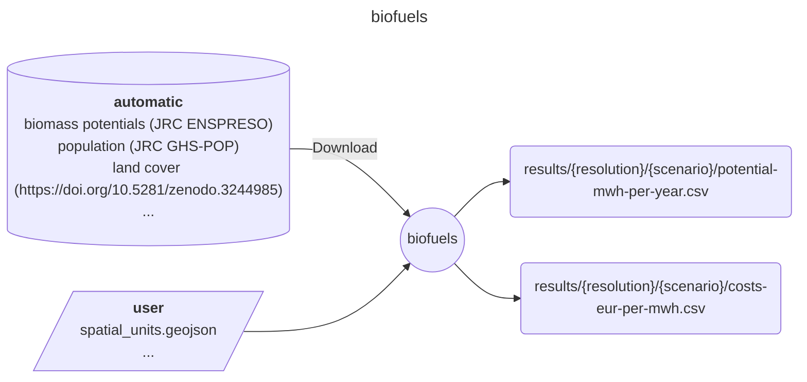

# Easy Energy Modules - biofuels

A module preparing biofuels cost and potentials

## Input-Ouput

Here is a brief IO diagram of the module's operation.

User
----
- resources/user/spatial_units.geojson

Output
------
- results/ehighways/high/potential-mwh-per-year.csv
- results/ehighways/high/costs-eur-per-mwh.csv
- results/ehighways/low/potential-mwh-per-year.csv
- results/ehighways/low/costs-eur-per-mwh.csv
- results/ehighways/medium/potential-mwh-per-year.csv
- results/ehighways/medium/costs-eur-per-mwh.csv

## DAG

Here is a brief example of the module's steps.

