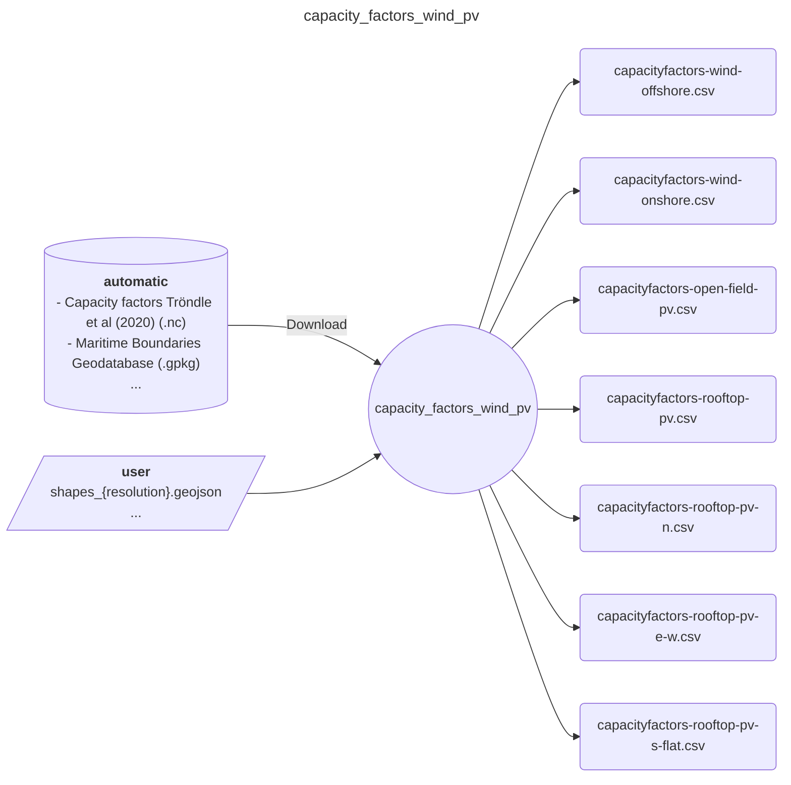
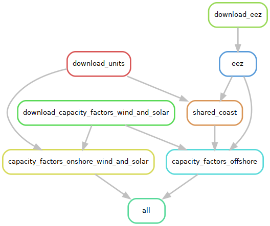

# Easy Energy Modules - capacity_factors_wind_pv

A module that prepares capacity factors for pv and wind, both onshore and offshore

## Input-Ouput

Here is a brief IO diagram of the module's operation.

### User

- **resources/user/shapes_{resolution}.geojson**: a file with the desired regional aggregation. CRS must be EPSG:4326.

### Results

- **results/{resolution}/{year}/capacityfactors-{technology}.csv**: timeseries file for the requested technology, year, and resolution.

### Wildcards

- `{resolution}` can by any name in alphanumeric (e.g., `ehighways`).
- `{year}` can be any year between (and including) `2000`-`2016`.
- `{technology}` can be any of the following: `wind-offshore`, `wind-onshore`, `open-field-pv`, `rooftop-pv`, `rooftop-pv-n`, `rooftop-pv-e-w`, `rooftop-pv-s-flat`.

## DAG

Here is a brief example of the module's steps.

## Citation

Tröndle, T., & Pickering, B. (2021). Euro-Calliope Wind and Solar Capacity Factors [Computer software]. <https://doi.org/10.5281/zenodo.3949793>

## References

- Flanders Marine Institute (2019). Maritime Boundaries Geodatabase: Maritime Boundaries and Exclusive Economic Zones (200NM), version 11. Available online at <https://www.marineregions.org/>. <https://doi.org/10.14284/386>
- Tröndle, T., & Pfenninger, S. (2020). Capacity factor time series for solar and wind power on a 50 km^2 grid in Europe [Data set]. Zenodo. <https://doi.org/10.5281/zenodo.3899687>
