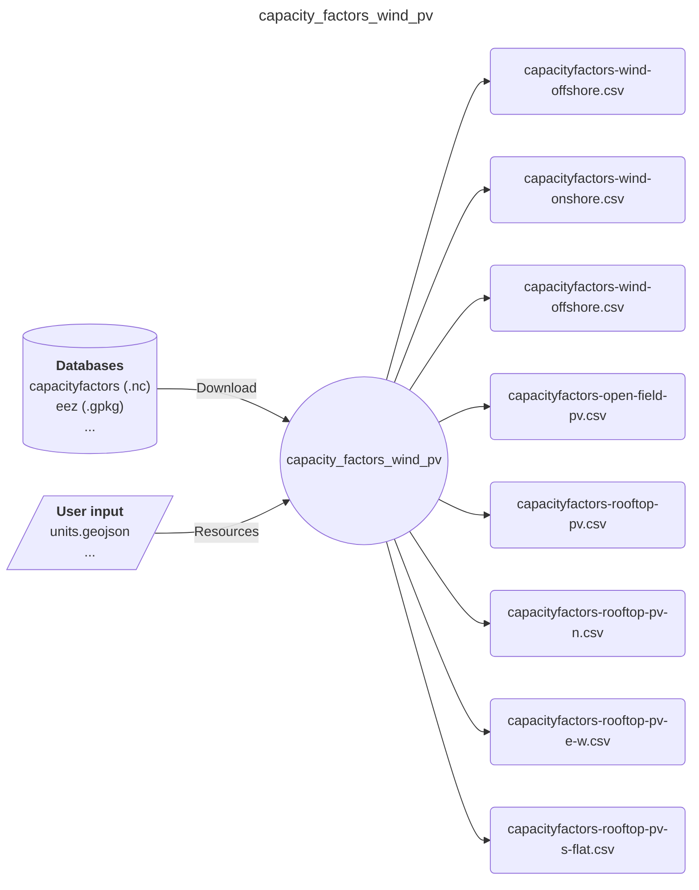

# Easy Energy Modules - capacity_factors_wind_pv

A module that prepares capacity factors for pv and wind, both onshore and offshore

## Input-Ouput

Here is a brief IO diagram of the module's operation.

## DAG

Here is a brief example of the module's steps.

