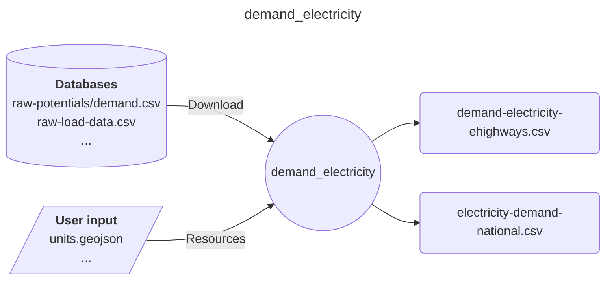
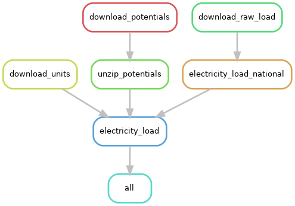

# Easy Energy Modules - demand_electricity

A module preparing electricity demand time series

## Input-Ouput

Here is a brief IO diagram of the module's operation.

## DAG

Here is a brief example of the module's steps.

