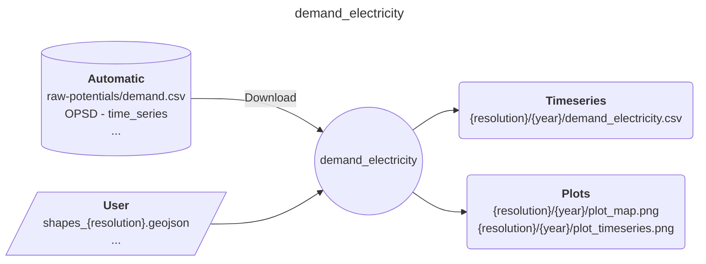

# Easy Energy Modules - demand_electricity

A module preparing electricity demand time series

## Input-Ouput

Here is a brief IO diagram of the module's operation.

### User

- **resources/user/shapes_{resolution}.geojson**: a file with the shapes in the desired spatial resolution.

### Results

- **{resolution}/{year}/demand_electricity.csv**: annual electricity demand per region.
- **{resolution}/{year}/plot_map.png**: map showing the distribution of annual demand.
- **{resolution}/{year}/plot_timeseries.png**: annual demand timeseries and load duration curve.

## DAG

Here is a brief example of the module's steps.

## Citation

Tröndle, T., & Pickering, B. (2021). Euro-Calliope Electricity Demand [Computer software]. <https://doi.org/10.5281/zenodo.3949793>

## References

- Open Power System Data (2020). Time series data package [Dataset]. <https://github.com/Open-Power-System-Data/time_series>
