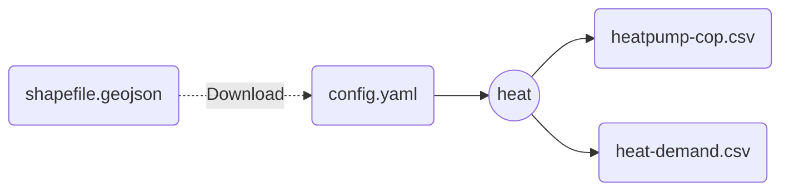
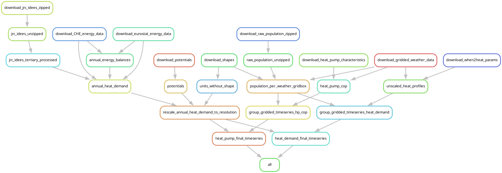

# Module: Heat

A module to estimate COP timeseries and heat demand timeseries for European countries.

>[!important]
>As of 08 Aug 2024, this module has only been tested for national-resolution time series of heat demand and heat pump cop.
>Time series at any resolution is coming soon!

## Main functionality

As of 08 Aug 2024, this module can produce national-resolution time series of heat demand and heat pump cop.

## Input-Output

Here is a brief summary of the IO structure of the module.

The configuration must point to a shapefile with the desired subregions, which will be downloaded and processed into timeseries and capacity values by the module.



## DAG

Here is a brief overview of the module's steps.
Please consult the code for more details.



## Remaining issues

Author: Chen Meijun, 08 Aug 2024
Reviewer: Ivan Ruiz, 18 Aug 2024

### General issues

1. `units.geojson` was temporarily put in the `resources` folder. The workflow for shapes or arbitrary resolution is still missing.
    - Ivan: unfortunately this polluted the repo history again, meaning pre-commit CI will most likely reject this module when we PR. We'll need to re-write the history of this commit or find an alternative method...
2. At this stage, this module can only deal with national resolution data. The interface between this module and the input of shapes file is also missing. To change that, we may need to (a) rewrite quite some rules so that they are compatible with the input shape file, and (b) add rules to transform national data into given shape file.
3. The contents of the current version of heat module is copied from euro-calliope, commit number cff23740. Any updates afterwards are not synced here.

### config-specific issues

1. Lots of data sources are from zenodo. At some point, we should check whether these data sources are reliable, and where they come from. For example, `potentials` comes from another workflow of Bryn.
2. For some reasons, there are two population-related data sources (in `potentials` and `population`). This should not happen in the future.
3. We might want to recheck how we fill the missing values for certain countries. Right now it is designated in config that the data of Albania is filled up by data from Bulgaria, Croatia, ...

### results-specific issues

1. How many files should be temporary files? Keeping some intermediate files there may help multi-time running of the workflow, but might cause storage problems in the local directory.
2. Because of the file structure of the old `euro-calliope`, the `results` folder is a bit messy. There's a folder called `national` which should disappear ultimately. Ideally, all results should be ordered in a way that is easy to find.

### envs-specific issues

1. `default.env` uses an old `pandas` version which, in combination with `xarray`, produces unstable behaviour. It should be updated to a more modern version, but it will most likely trigger script updates.
2. `default.env` has no `geopandas` dependency, meaning that we translate the `.geojson` file into a `.csv` for processing in those steps. This should be avoided by just passing the `.geojson` file to those rules and opening it with `geopandas`.

### rules-specific issues

1. The namings of the rules are directly copied from euro-calliope and may not really make sense. We might want to change them to more understandable names.
2. The data processing of eurostat and Swiss data is quite messy in terms of rule dependencies. We might want to simplify them later.

### scripts-specific issues

1. The namings of the scripts might not make sense. The scripts are directly copied from euro-calliope and not checked in detail.
2. We might want to separate scripts into different sub-folders according to their functionalities (e.g. which snakefile they are related to).

### When2Heat extraction

1. Scripts and snakemake rules currently extract all When2Heat parameters in a directory and use the `directory()` directive.
2. We probably want to remove this and make it so that specific variables are downloaded only if requested (like the gridded-weather-data).

## Pending update of the README

General file structure to follow for `snakemake` modules.

>[!important]
>Always call snakemake at the `example_module/` level, not at the workflow level!
>This is by `snakemake` design.

```ascii
example_module/
┣ config/                # Default configuration, can be overridden!
┃ ┗ config.yaml
┣ resources/             # Static files needed by your workflow
┣ results/               # Put all rule outputs here!
┣ workflow/
┃ ┣ envs/                # Conda environments
┃ ┃ ┗ example_env.yaml
┃ ┣ report/              # For snakemake's report functionality
┃ ┣ rules/               # Rule files
┃ ┃ ┗ example.smk
┃ ┣ schemas/             # Schemas to check configuration files
┃ ┃ ┗ config.schema.yaml
┃ ┣ scripts/             # Actual code!
┃ ┃ ┗ example.py
┃ ┗ Snakefile            # main rule lives here!
┣ LICENSE
┗ README.md
```
