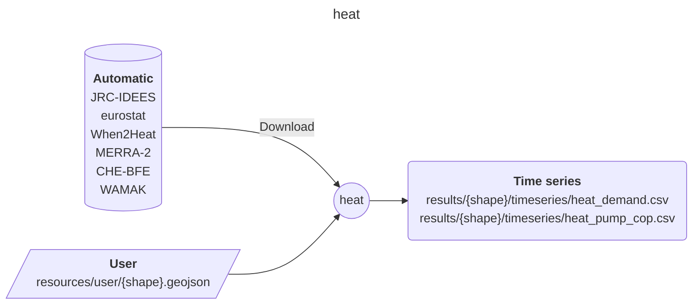

<!-- Please provide a concise summary of the module in this section. -->
<!-- --8<-- [start:intro] -->
# heat

A module to generate timeseries for building heat demand and heatpump COP for European countries.

>**important**
>As of 10 Sept 2024, this module has only been tested for national-resolution time series of heat demand and heatpump COP.
>Time series at any resolution is coming soon!

<!-- --8<-- [end:intro] -->

## Input-Output

<!-- Please fill in this diagram including: wildcards, user resources and final results. -->
<!-- --8<-- [start:mermaid] -->

<!-- --8<-- [end:mermaid] -->

### Wildcards

<!-- Please explain what wildcards are required by users here. -->
<!-- --8<-- [start:wildcards] -->

- **{shape}**: Determines the number of regions that the module will process. Importantly, it must be specified for the correct input file, which can be obtained from [Euro-Calliope datasets](https://zenodo.org/records/6600619). The following options are possible:
    - national

<!-- --8<-- [end:wildcards] -->

### User
<!-- Please briefly explain user resources here. -->
<!-- --8<-- [start:user] -->

- **resources/user/{shape}.geojson**: desired regional aggregation. CRS must be EPSG:4326.

<!-- --8<-- [end:user] -->
### Results
<!-- Please briefly explain final result files here. -->
<!-- --8<-- [start:results] -->

- **results/{shape}/timeseries/heat_demand.csv**: heat demand timeseries in 100 GW p.u. .
- **results/{shape}/timeseries/heat_pump_cop.csv**: heat pump coefficient of performance (COP) timeseries.

<!-- --8<-- [end:results]  -->

Pickering, B., Lombardi, F., Pfenninger, S., 2022. Diversity of options to eliminate fossil fuels and reach carbon neutrality across the entire European energy system. Joule. DOI:10.1016/j.joule.2022.05.009

## References
<!-- Please cite studies and datasets used for this workflow below. -->
<!-- --8<-- [start:references] -->

- Ruhnau, O., Hirth, L. & Praktiknjo, A. Time series of heat demand and heat pump efficiency for energy system modeling. Sci Data 6, 189 (2019). <https://doi.org/10.1038/s41597-019-0199-y>
- Mantzos, L., Matei, N., Mulholland, E., Rózsai, M., Tamba, M. and Wiesenthal, T., The JRC Integrated Database of the European Energy System, European Commission, 2018, JRC112474.
- Pickering, B., & Pfenninger, S. (2024). Temperature and wind speed time series on a 50 km^2 grid in Europe (2024-06-07) [Data set]. Zenodo. <https://doi.org/10.5281/zenodo.11516744>
- eurostat: European Union, 2011 - today. For more details, please refer to the [Eurostat copyright policy](https://ec.europa.eu/eurostat/web/main/help/copyright-notice). Please consult the code to identify how this data is processed.

<!-- --8<-- [end:references] -->

## Remaining issues

Author: Chen Meijun, 08 Aug 2024
Reviewer: Ivan Ruiz, 18 Aug 2024

### General issues

1. At this stage, this module can only deal with national resolution data. The interface between this module and the input of shapes file is also missing. To change that, we may need to (a) rewrite quite some rules so that they are compatible with the input shape file, and (b) add rules to transform national data into given shape file.
2. The contents of the current version of heat module is copied from euro-calliope, commit number cff23740. Any updates afterwards are not synced here.

### config-specific issues

1. Lots of data sources are from zenodo. At some point, we should check whether these data sources are reliable, and where they come from. For example, `potentials` comes from another workflow of Bryn.
2. For some reason, there are two population-related data sources (in `potentials` and `population`). This should not happen in the future.
3. We might want to recheck how we fill the missing values for certain countries. Right now it is designated in config that the data of Albania is filled up by data from Bulgaria, Croatia, ...

### envs-specific issues

1. `default.env` uses an old `pandas` version which, in combination with `xarray`, produces unstable behaviour. It should be updated to a more modern version, but it will most likely trigger script updates.
2. `default.env` has no `geopandas` dependency, meaning that we translate the `.geojson` file into a `.csv` for processing in those steps. This should be avoided by just passing the `.geojson` file to those rules and opening it with `geopandas`.

### rules-specific issues

1. The data processing of eurostat and Swiss data is quite messy in terms of rule dependencies. We might want to simplify them later.

### When2Heat extraction

1. Scripts and snakemake rules currently extract all When2Heat parameters in a directory and use the `directory()` directive. We probably want to remove this and make it so that specific variables are downloaded only if requested (like the gridded-weather-data).
