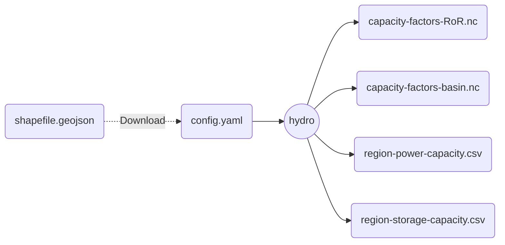

# Easy Hydropower data

Generate timeseries for hydropowerplants in Europe.

```mermaid
flowchart LR
    I1(shapefile.geojson) -.-> |Download| C
    C(config.yaml) -->M((hydro))
    M --> O1(capacity-factors-RoR.nc)
    M --> O2(capacity-factors-basin.nc)
    M --> O3(region-power-capacity.csv)
    M --> O4(region-storage-capacity.csv)
```
