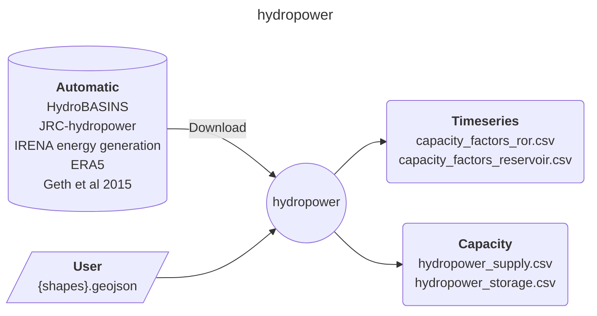

<!-- Please provide a concise summary of the module in this section. -->
<!-- --8<-- [start:intro] -->
# hydropower

A module to produce hourly timeseries of hydropower plants in Europe.

<!-- --8<-- [end:intro] -->

## Input-Output

<!-- Please fill in this diagram including: wildcards, user resources and final results. -->
<!-- --8<-- [start:mermaid] -->

<!-- --8<-- [end:mermaid] -->

### Wildcards
<!-- Please explain what wildcards are required by users here. -->
<!-- --8<-- [start:wildcards] -->

- **{shape}**: Determines the number of regions that the module will process. Any regional aggregation within Europe is possible.

<!-- --8<-- [end:wildcards] -->
### User
<!-- Please briefly explain user resources here. -->
<!-- --8<-- [start:user] -->

- **resources/user/{shapes}.geojson**: a file with the desired regional aggregation. CRS must be EPSG:4326.

<!-- --8<-- [end:user]  -->
### Result files
<!-- Please briefly explain final result files here. -->
<!-- --8<-- [start:results] -->

- **results/shapes/{shapes}/supply_capacity.csv**: generation capacity per region.
- **results/shapes/{shapes}/storage_capacity.csv**: storage capacity per region.
- **results/shapes/{shapes}/{year}/capacity_factors_reservoir.csv**: normalised capacity factor timeseries for reservoirs.
- **results/shapes/{shapes}/{year}/capacity_factors_ror.csv**: normalised capacity factor timeseries for run-of-river.

<!-- --8<-- [end:results]  -->

## References
<!-- Please cite studies and datasets used for this workflow below. -->
<!-- --8<-- [start:references] -->

- Lehner, B. and Grill, G. (2013), Global river hydrography and network routing: baseline data and new approaches to study the world's large river systems. Hydrol. Process., 27: 2171-2186. <https://doi.org/10.1002/hyp.9740>
- Geth, F., Brijs, T., Kathan, J., Driesen, J., & Belmans, R. (2015). An overview of large-scale stationary electricity storage plants in Europe: Current status and new developments. Renewable and Sustainable Energy Reviews, 52, 1212-1227.
- Hofmann, F., Hampp, J., Neumann, F., Brown, T., & Hörsch, J. (2021). atlite: A Lightweight Python Package for Calculating Renewable Power Potentials and Time Series (Version 0.2.5) [Computer software]. <https://doi.org/10.21105/joss.03294>

<!-- --8<-- [end:references] -->
