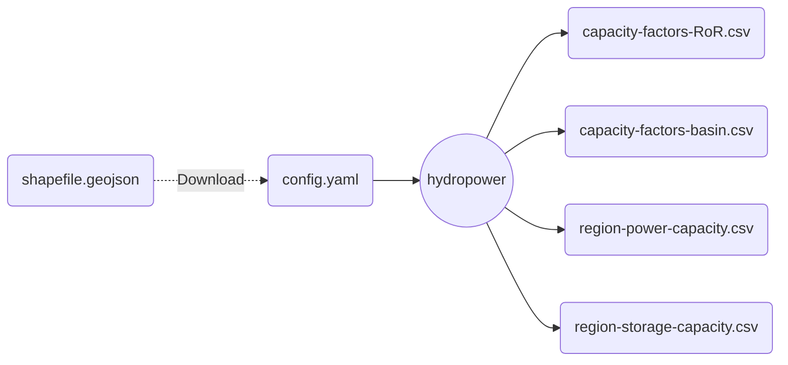

# Module: Hydropower

A module to estimate hydropower capacity factors and powerplant capacities for arbitrary regions in Europe.

## Input-Output

Here is a brief summary of the IO structure of the module.

Users must specify a remote location of shapefile with the desired subregions in the configuration, which will be downloaded and processed into timeseries and capacity values by the module.

## DAG

Here is a brief overview of the module's steps.
Please consult the code for more details.

