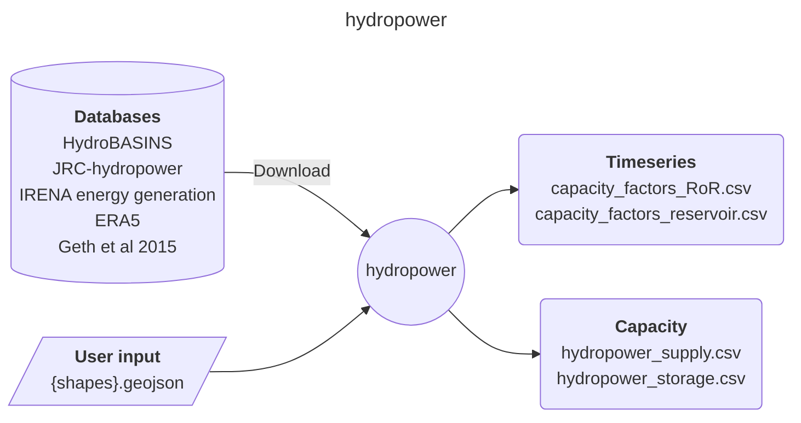
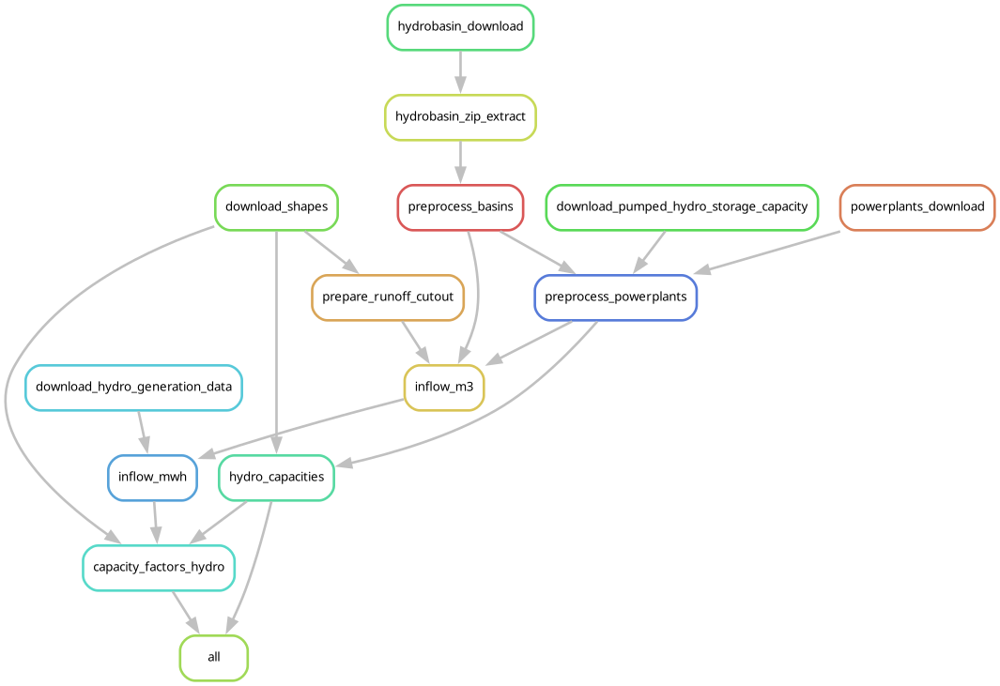

# Easy Energy Modules - hydropower

A module to produce hourly timeseries of hydropower plants in Europe.

## Input-Output

Here is a brief IO diagram of the module's operation.

### User input

- **{shapes}.geojson**: a file with poligons of the desired regional aggregation, with at least:
    - An _id_ column with an unique identifier.
    - A _geometry_ column with multi-polygon shapes.
    - CRS in EPSG:4326

    | id  | geometry   |
    |-----|--------------|
    | AUT | MULTIPOLYGON |
    | BEL | MULTIPOLYGON |
    | ... | ...          |

## DAG

Here is a brief example of the module's steps.

## Citation

Tröndle, T., & Pickering, B. (2021). Euro-Calliope Hydropower [Computer software]. https://doi.org/10.5281/zenodo.3949793

## References

- Lehner, B. and Grill, G. (2013), Global river hydrography and network routing: baseline data and new approaches to study the world's large river systems. Hydrol. Process., 27: 2171-2186. https://doi.org/10.1002/hyp.9740
- Geth, F., Brijs, T., Kathan, J., Driesen, J., & Belmans, R. (2015). An overview of large-scale stationary electricity storage plants in Europe: Current status and new developments. Renewable and Sustainable Energy Reviews, 52, 1212-1227.
- Hofmann, F., Hampp, J., Neumann, F., Brown, T., & Hörsch, J. (2021). atlite: A Lightweight Python Package for Calculating Renewable Power Potentials and Time Series (Version 0.2.5) [Computer software]. https://doi.org/10.21105/joss.03294
