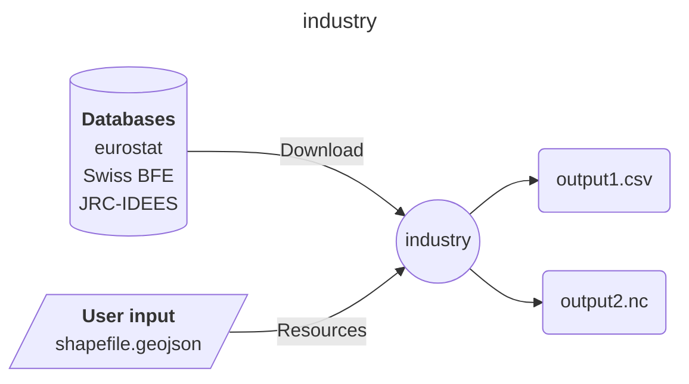
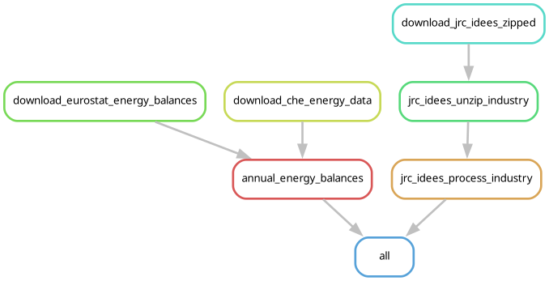

# Easy Energy Modules - industry

A module to estimate industrial energy demand and decarbonisation potential in European subregions.

## Input-Ouput

Here is a brief IO diagram of the module's operation.

## DAG

Here is a brief example of the module's steps.

