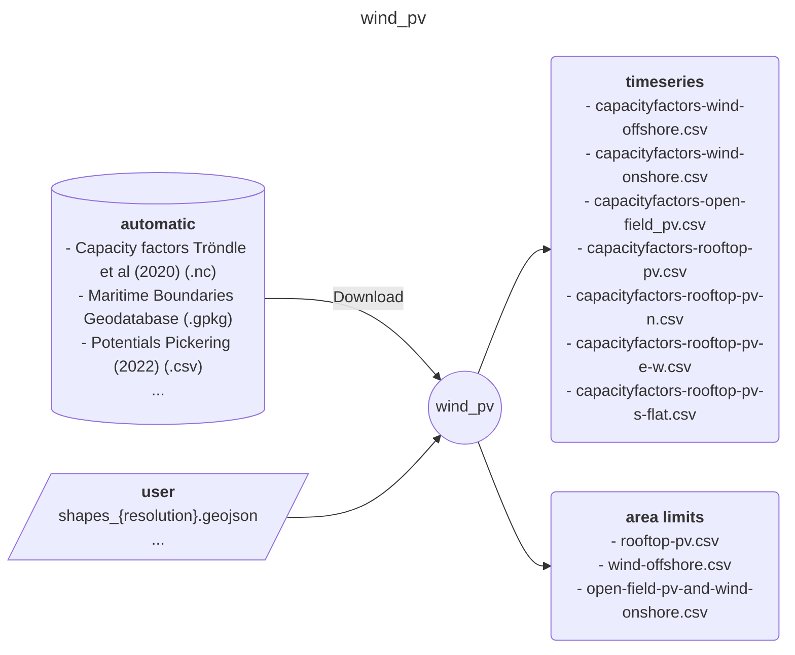

<!-- Please provide a concise summary of the module in this section. -->
<!-- --8<-- [start:intro] -->
# wind_pv

A module that prepares capacity factors for pv and wind, both onshore and offshore.

<!-- --8<-- [end:intro] -->
## Input-Ouput
<!-- Please fill in this diagram including: wildcards, user resources and final results. -->
<!-- --8<-- [start:mermaid] -->

<!-- --8<-- [end:mermaid] -->

### Wildcards
<!-- Please explain what wildcards are required by users here. -->
<!-- --8<-- [start:wildcards] -->

- **{resolution}**: Determines the number of regions that the module will process. Importantly, it must be specified for the correct input file, which can be obtained from [Euro-Calliope datasets](https://zenodo.org/records/6600619). The following options are possible:
    - national
    - regional
    - ehighways
    - continental
- **{year}**: The weather year to process. Can be any year between (and including) `2000`-`2016`.
- **{technology}**: The technology to process. Can be any of the following:
    - wind-offshore
    - wind-onshore
    - open-field-pv
    - rooftop-pv
    - rooftop-pv-n
    - rooftop-pv-e-w
    - rooftop-pv-s-flat
- **{scenario}**: The socio-technial scenario to process, which will constrain the amount of land use allowed (See @Trondle:2019 for more information). Can be any of the following:
    - technical-potential
    - technical-potential-protected
    - technical-social-potential

<!-- --8<-- [end:wildcards] -->
### User files
<!-- Please briefly explain user resources here. -->
<!-- --8<-- [start:user] -->

- **resources/user/shapes_{resolution}.geojson**: a file with the desired regional aggregation. CRS must be EPSG:4326.

<!-- --8<-- [end:user] -->
### Results files
<!-- Please briefly explain final result files here. -->
<!-- --8<-- [start:results] -->

- **results/{resolution}/{year}/capacityfactors-{technology}.csv**: timeseries file for the requested technology, year, and resolution.
- **results/{resolution}/{scenario}/rooftop-pv.csv**: area potential for all rooftop-pv configurations.
- **results/{resolution}/{scenario}/wind-offshore.csv**: area potential for offshore wind.
- **results/{resolution}/{scenario}/open-field-pv-and-wind-onshore.csv**: area potential for open field pv and onshore wind.

<!-- --8<-- [end:results]  -->
## References
<!-- Please cite studies and datasets used for this workflow below. -->
<!-- --8<-- [start:references] -->

- Flanders Marine Institute (2019). Maritime Boundaries Geodatabase: Maritime Boundaries and Exclusive Economic Zones (200NM), version 11. Available online at <https://www.marineregions.org/>. <https://doi.org/10.14284/386>
- Tröndle, T., & Pfenninger, S. (2020). Capacity factor time series for solar and wind power on a 50 km^2 grid in Europe [Data set]. Zenodo. <https://doi.org/10.5281/zenodo.3899687>
- Pickering, B. (2022). Auxiliary Euro-Calliope datasets: Spatial data to represent a European energy system model at several spatial resolutions (2022-05-31) [Data set]. Zenodo. <https://doi.org/10.5281/zenodo.6600619>

For the default configuration:

- **@EuropeanEnvironmentAgency:2009:** European Environment Agency. (2009). _Europe’s onshore and offshore wind energy potential_ [Publication]. <https://www.eea.europa.eu/publications/europes-onshore-and-offshore-wind-energy-potential>.
- **@Gagnon:2016:** Gagnon, P., Margolis, R., Melius, J., Phillips, C., Elmore, R. (2016). Estimating rooftop solar technical potential across the US using a combination of GIS-based methods, lidar data, and statistical modeling. _Environmental Research Letters_. <https://doi.org/10.1088/1748-9326/aaa554>
- **@Klauser:2016:** Klauser, D. (2016). _Solarpotentialanalyse für Sonnendach.ch_ (p. 50). Swiss Federal Office of Energy. <https://www.bfe.admin.ch/bfe/de/home/news-und-medien/publikationen.exturl.html/aHR0cHM6Ly9wdWJkYi5iZmUuYWRtaW4uY2gvZGUvcHVibGljYX/Rpb24vZG93bmxvYWQvODE5Ng==.html>
- **@Trondle:2019:** Tröndle, T., Pfenninger, S., & Lilliestam, J. (2019). Home-made or imported: On the possibility for renewable electricity autarky on all scales in Europe. Energy strategy reviews, 26, 100388. <https://doi.org/10.1016/j.esr.2019.100388>
- **@Wirth:2017:** Wirth, H. (2017). _Aktuelle Fakten zur Photovoltaik in Deutschland_. Fraunhofer ISE. <https://www.ise.fraunhofer.de/de/daten-zu-erneuerbaren-energien.html>.

<!-- --8<-- [end:references] -->
