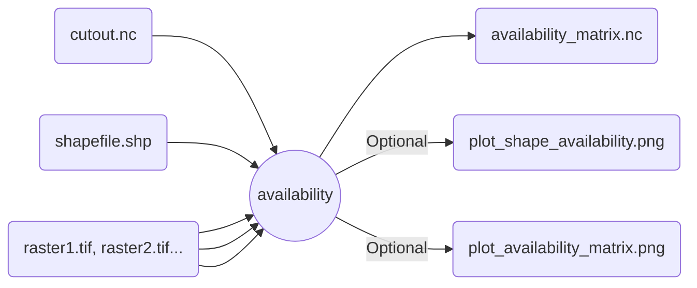

# `atlite` land-use availability

For the given shapes and cutout, combine raster files to filter land area. The result is a netCDF file with the usable land ratio per cell.

>[!important]
>`raster`, `raster_codes` and `raster_kwargs` must always match in length!
>Use `{}` if no kwargs want to be passed.

