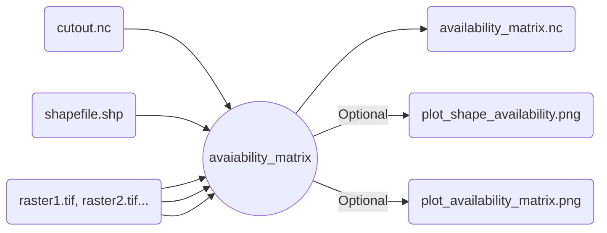

# Wrapper for `atlite` land-use availability

For the given shapes in the cutout, combine raster files and filter land area. The result is a netCDF file with the usable land ratio per cell.

>[!important]
>`raster`, `raster_codes` and `raster_kwargs` must always match in length! Use `{}` if no kwargs want to be passed.



## Example

```snakemake
rule atlite_cutout:
    input:
        cutout = "cutout.nc",
        shapefile = "portugal.geojson",
        rasters = ["dem_tdem_pt_80m.tif", "heat_pt_80m.tif"],
    output:
        availability_matrix = "output/av_matrix.nc",
        plot_shape_availability = "output/shape.png",
        plot_availability_matrix = "output/matrix.png"
    params:
        shapefile_name_column = "state",
        raster_codes = {[1, 2, 3, 4, 5], [80, 110]},
        raster_kwargs = [{"invert": True}, {}]
    threads: 4
    wrapper: "file:../"
```
