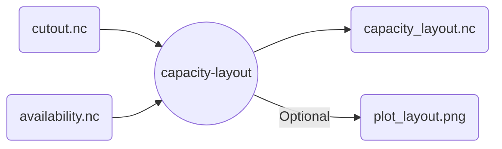

# `atlite` capacity layout

For the given cutout, use the availability matrix and the maximum capacity per km2 to calculate the maximum capacity layout for the region.

```mermaid
flowchart LR
    I1(cutout.nc) --> W((capacity-layout))
    I2(availability.nc) --> W
    W --> O1(capacity_layout.nc)
    W --> |Optional| O2(plot_layout.png)
```
