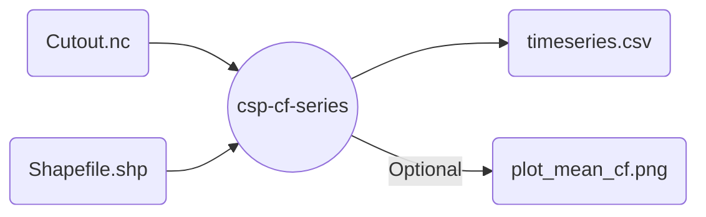

# Concentrated Solar Power capacity factor series with `atlite`

Uses a cutout with CSP relevant data to produce capacity factor timeseries for energy system models.
Optionally, get some nice plots with the average CF per calculated region.



## Example

```snakemake
code here
```
