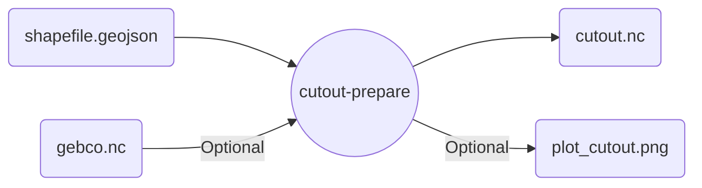

# `atlite` cutout-prepare

Download cutout data for the requested shapefile, prepare it for `atlite` functions, and save it locally for reuse.

>[!important]
>`atlite` may ignore parameters if the cutout already exists!

