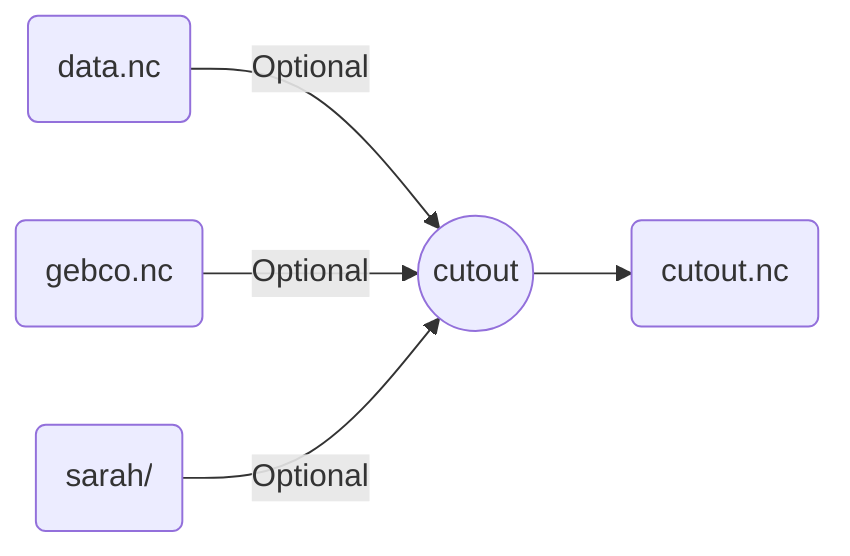

# Wrapper for `atlite` cutout functionality

Take / download cutout data for the requested latitude/longitude, prepare it for `atlite` functions, and save it locally for reuse.

>[!important]
>`atlite` data reading is not combinatorial. Three cases are possible AND EXCLUSIVE EACH OTHER:
>
>1. Cutout already exists in given path -> take it.
>2. Optional input data is specified and exists -> take it.
>3. Otherwise, build cutout only using snakemake.params.
>
>Also, `atlite` downloads all possible features by default. This can take hours, so we force users to specify the features they need to save time.
>
>Finally, using the `sarah` module requires you to specify a directory, not a file. Use relevant `snakemake` functionality with this in mind!



## Example

```snakemake
rule atlite_cutout:
    output:
        path = "output/test.nc",
    params:
        module = "era5",
        time = "2012-01-01",
        x = [3.9, 4.7],
        y = [50, 52.2],
        cutout_offset = 1,
        features = ["wind", "runoff"]
    threads: 4
    wrapper: github("calliope-project/ec_modules", path="wrappers/atlite/cutout")
```
