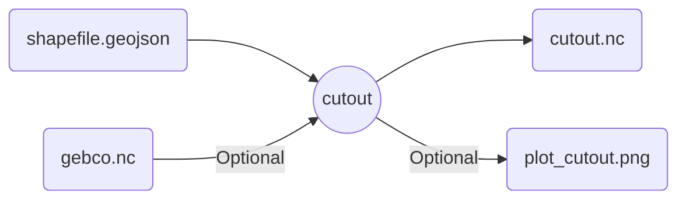

# `atlite` cutout

Download cutout data for the requested shapefile, prepare it for `atlite` functions, and save it locally for reuse.

```mermaid
flowchart LR
    I1(shapefile.geojson) --> W((cutout))
    I2(gebco.nc) --> |Optional| W
    W --> O1(cutout.nc)
    W --> |Optional|O2(plot_cutout.png)
```
