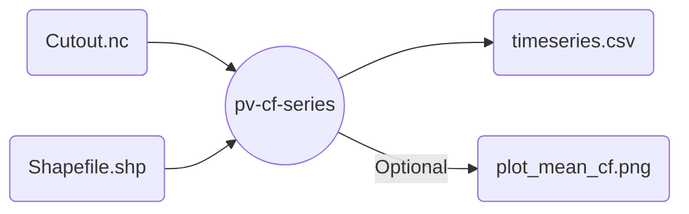

# Wrapper for producing pv capacity factor series with `atlite`

Uses a cutout with PV relevant data to produce timeseries for energy system models.
Optionally, get some nice plots with the average CF per calculated region.



## Example

```snakemake
rule atlite_pv_cf_series:
    input:
        cutout = "test.nc",
        shapefile = "portugal.geojson"
    output:
        timeseries = "output/portugal.csv",
        plot_mean_cf = "output/mean_cf.png"
    params:
        shapefile_name_column = "state",
        pv_panel = "CSi",
        pv_orientation = "latitude_optimal",
    threads: 4
    wrapper: github("calliope-project/ec_modules", path="wrappers/atlite/pv-cf-series")
```
