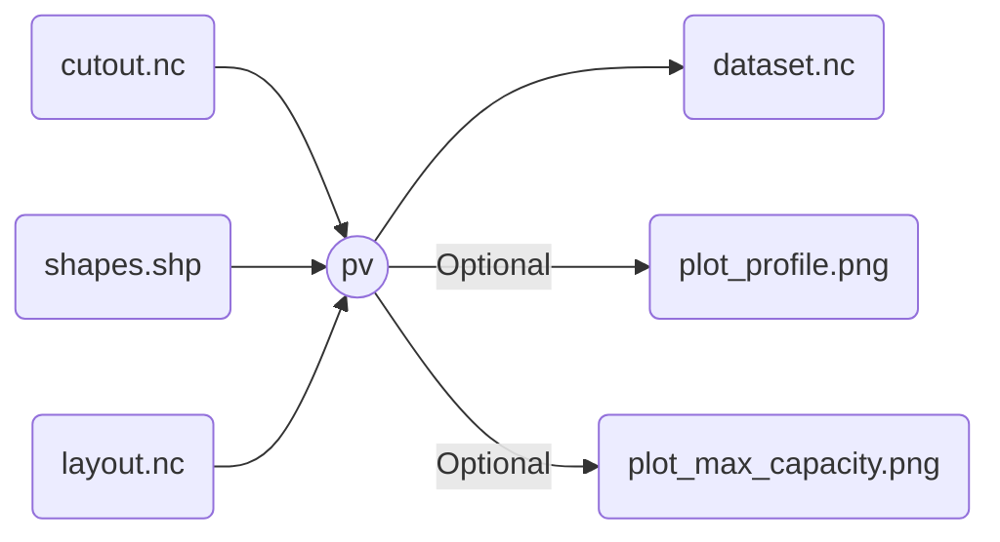

# `atlite` pv

Uses a cutout with pv-relevant features to produce a dataset with:

- Profile time-series (either capacity factor or maximum generation)
- Maximum installable-capacity per region

Optionally, get plots for the generation profile and max. capacity.

