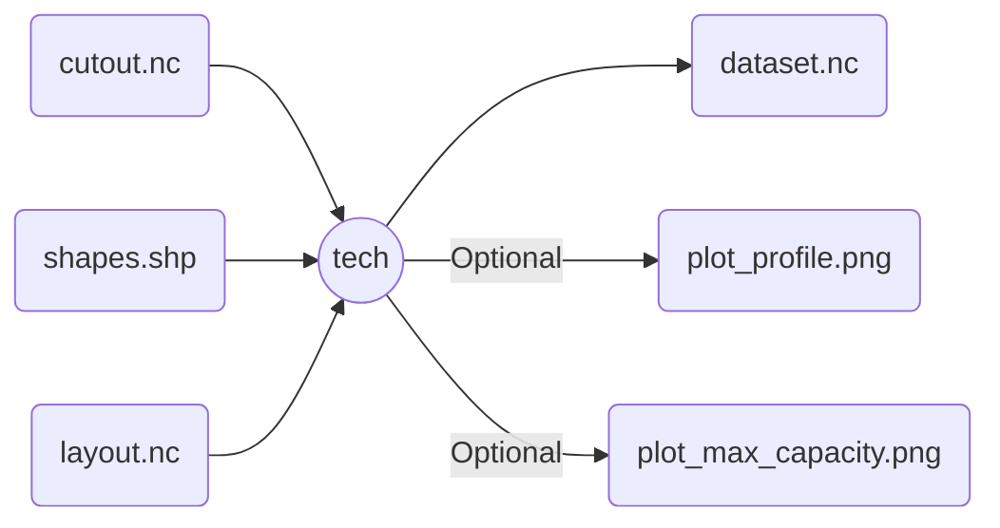

# `atlite` technology wrapper

Uses a cutout with technology-relevant features to produce a dataset with:

- Profile time-series (either capacity factor or maximum generation)
- Maximum installable-capacity per region

Optionally, get some nice plots for the profile and max. capacity.

>[!important]
>This helper wrapper is only valid for the following technology functions in `atlite`: `pv`, `wind`, `csp`.
>
>Keep in mind that the required parameters change between them!

