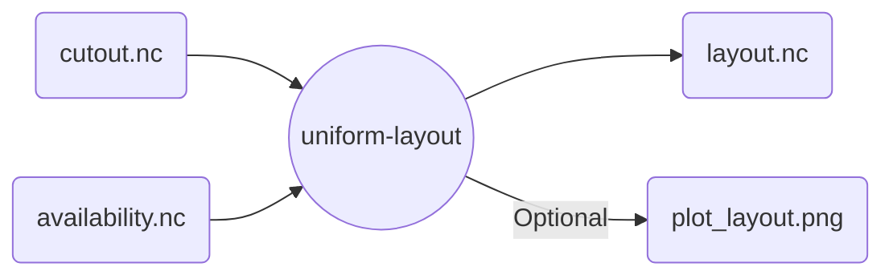

# `atlite` uniform layout

For the given cutout, use the availability matrix to calculate the maximum unit-per-km2 (e.g, MW per km2).

```mermaid
flowchart LR
    I1(cutout.nc) --> W((uniform-layout))
    I2(availability.nc) --> W
    W --> O1(layout.nc)
    W --> |Optional| O2(plot_layout.png)
```
