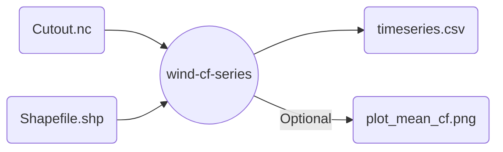

# Wind capacity factor series with `atlite`

Uses a cutout with wind relevant data to produce capacity factor timeseries for energy system models.
Optionally, get some nice plots with the average CF per calculated region.



## Example

```snakemake
rule atlite_wind_cf_series:
    input:
        cutout = "cutout_wind.nc",
        shapefile = "portugal.geojson"
    output:
        timeseries = "output/wind_cf.csv",
        plot_mean_cf = "output/mean_cf.png"
    params:
        shapefile_name_column = "state",
        wind_turbine = "Vestas_V90_3MW",
        shapefile_specific_names = ["PT-07","PT-09","PT-18"]
    threads: 4
    wrapper: github("calliope-project/ec_modules", path="wrappers/atlite/wind-cf-series")
```
