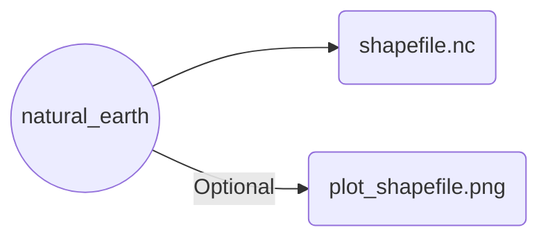

# `cartopy` shapes from natural earth

Fetches a shapefile from [Natural Earth](https://www.naturalearthdata.com/).
Optionally, you can run one query.

```mermaid
flowchart LR
    W((natural_earth))
    W --> O1(shapefile.nc)
    W -->|Optional|O2(plot_shapefile.png)
```
