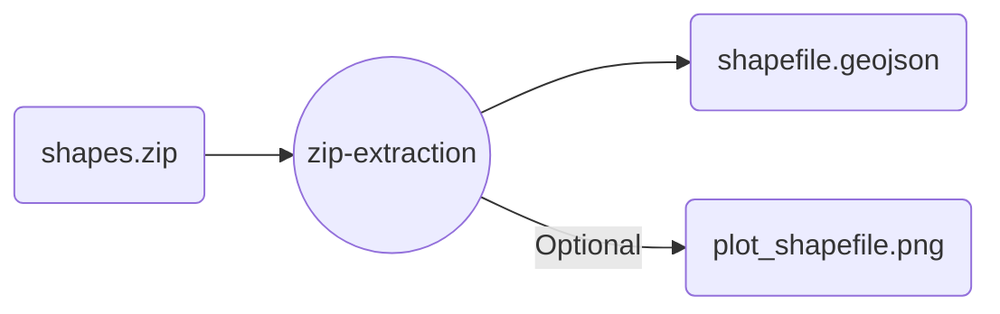

# `geopandas` zip extraction

Extract a shapefile from a `.zip` file and save it.

Useful for `.shp`/`.shx` formats that are often zipped.

>[!important]
>Verify the location within the `.zip` carefully!
>Seach is done as follows:
>
>`you_zipfile.zip/zip_filepath.shp`

