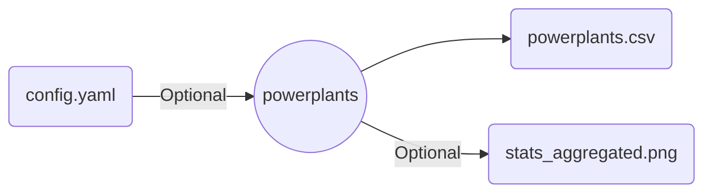

# Wrapper for powerplantmatching powerplants

Runs `powerplantmatching`'s matching process with optional custom configurations.



>[!warning]
>Although useful, `powerplantmatching` is a risky datasource for the following reasons:
>
>- Updated data tends to change between releases due to the unstable nature of the algorithm employed.
>- DOUBLE COUNTING MAY STILL HAPPEN!
>- The resulting data is not a perfect match with national statistics.
>
>Use with care!

## Example

```snakemake
rule ppm_powerplants:
    input:
        config= "config.yaml"
    output:
        powerplants= "output/powerplants.csv",
        stats_aggregated = "output/stats_aggregated.png",
    params:
        from_url= False
    threads: 8
    wrapper: github("calliope-project/ec_modules", path="wrappers/powerplantmatching/powerplants")
```
