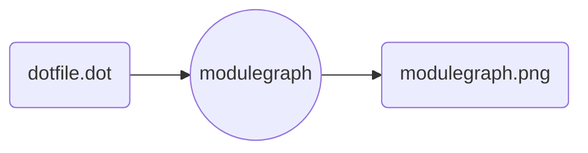

# `snakemake` - modulegraph

Converts a snakemake .dot file (e.g., `--rulegraph`, `--dag`) into a modulegraph for the requested prefixes.

This new graph will combine all rules with the specified prefixes into one, making reading large modular workflows much easier.

