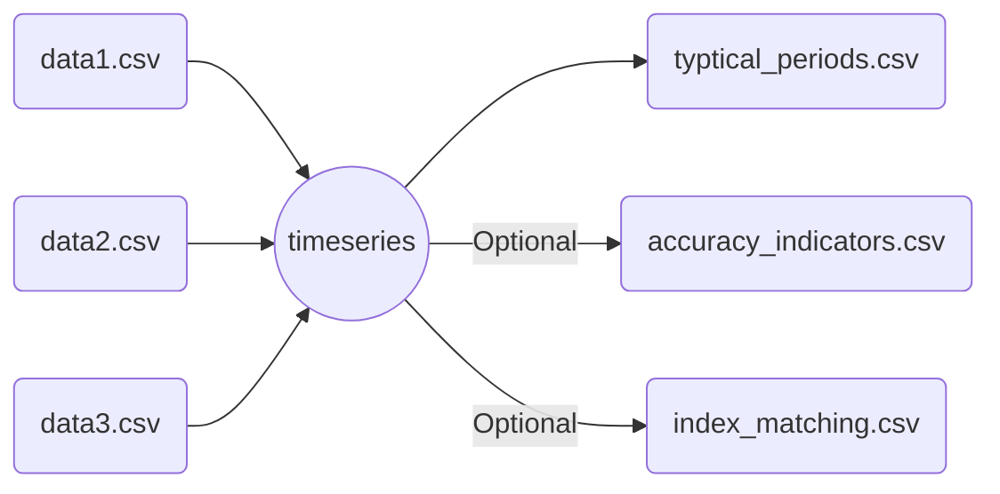

# `tsam` - time series aggregation methods

Runs `tsam` time series aggregation methods for a list of time series files.
Optionally, outputs accuracy indicator data and index matching data.

>[!INFO]
>Multiple variables per file are possible, but the variable names must be unique across all files!

